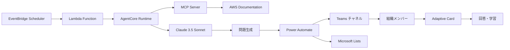

# Cloud CoPassAgent 設計書

## 概要

**Cloud CoPassAgent**は、クラウド資格学習を通じて組織内のコミュニケーション(Co)を促し、合格とスキルの橋渡し(Pass)を支援する AI エージェントです。

### 設計原則

- **垂直スライス開発**: 水平レイヤーより完全な価値提供フローを優先
- **シンプル化**: 複雑な基盤構築を避け、動く価値の早期提供
- **品質とスピード両立**: 品質を妥協せず、効率的な開発プロセス
- **技術的正確性**: MCP 統合による AWS 公式ドキュメント参照

## 技術選択の記録

### なぜ AgentCore Runtime を選んだか

**選択理由**:

- **AWS 公式**: Bedrock AgentCore は AWS 公式のエージェント実行環境
- **MCP 統合**: Model Context Protocol の標準的な統合サポート
- **運用・監視**: CloudWatch との自動統合による運用の容易さ
- **学習効果**: 最新の AI エージェント技術の実践的習得

**代替案との比較**:

- Lambda 単体: MCP 統合の複雑さ、エージェント機能の制限
- ECS/Fargate: 運用コストの高さ、オーバーエンジニアリング
- 自前実装: 開発コストの高さ、品質リスク

### なぜシンプル化したか

**背景**:

- 当初設計: DynamoDB + 複雑なサービス層 + リアクション収集機能
- 実装判断: AgentCore 中心のシンプル構成に変更

**シンプル化の価値**:

- **早期価値提供**: 1 週間での Teams 投稿実現
- **品質向上**: 複雑性削減による品質管理の容易さ
- **学習効果**: 垂直スライス開発の実践的習得
- **フィードバック収集**: 実際のユーザー体験による改善点発見

**削除した機能と判断理由**:

- DynamoDB: MVP では永続化不要、Power Automate で十分
- リアクション収集: 次イテレーションで実装予定
- 複雑なサービス層: AgentCore で直接実装が効率的

## システムアーキテクチャ

### 実装済みシステム構成



### 主要コンポーネント

#### 1. 問題生成システム（AgentCore Runtime）

- **実行環境**: AWS Bedrock AgentCore Runtime
- **AI モデル**: Claude 3.5 Sonnet
- **MCP 統合**: AWS Documentation MCP Server による技術的正確性確保
- **品質保証**: AWS 公式ドキュメント参照による正確性確保

#### 2. 配信システム（Power Automate + Teams）

- **自動投稿**: Adaptive Card 形式での構造化表示
- **データ登録**: Microsoft Lists（SharePoint）への問題履歴保存
- **ユーザー体験**: 「回答を見る」ボタンによる段階的情報提示

#### 3. 定期実行システム（EventBridge Scheduler）

- **自動実行**: 指定時間での問題生成・配信
- **監視**: CloudWatch Logs による実行状況記録
- **エラーハンドリング**: 障害時の適切なログ記録

## 技術スタック

### AI エージェント基盤

- **エージェントフレームワーク**: Strands Agents
- **実行環境**: AWS Bedrock AgentCore Runtime
- **LLM**: Amazon Bedrock Claude 3.5 Sonnet
- **MCP 統合**: AWS Documentation MCP Server

### バックエンド・インフラ

- **言語**: Python 3.12
- **パッケージ管理**: uv（高速・信頼性の高い依存関係管理）
- **定期実行**: EventBridge Scheduler → Lambda → AgentCore Runtime
- **監視**: CloudWatch Logs + X-Ray トレーシング

### 外部連携

- **Teams 統合**: Power Automate（Webhook → Teams 投稿 → Microsoft Lists 登録）
- **データ保存**: Microsoft Lists（SharePoint）による問題履歴管理
- **表示形式**: Adaptive Card による構造化表示

### デプロイ・運用

- **デプロイツール**: bedrock-agentcore-starter-toolkit
- **設定管理**: agentcore configure
- **品質管理**: Ruff（リンター・フォーマッター）+ Mypy（型チェック）+ pytest

## データモデル

### 問題データ構造

```python
class Question:
    question: str           # 問題文
    options: List[str]      # 選択肢（A-D以上、太字記法使用）
    correct_answer: str     # 正解（A, B, C, D...のラベルのみ）
    explanation: str        # 詳細解説
    source: List[str]       # AWS公式ドキュメントURL（MCP Server検証済み）

    # 新機能: 試験ガイド活用による問題分類表示
    learning_domain: str    # 学習分野分類（汎用的な命名）
    primary_technologies: List[str]  # 主要技術要素リスト（最大3つ）
    guide_reference: str    # 試験ガイドの項目参照（汎用的な命名）

class AgentOutput:
    questions: List[Question]  # 生成された問題のリスト（複数問題対応）

class AgentInput:
    exam_type: str          # 試験の種類（現在: "SAP"、新機能で"AWS-SAP-C02"等のファイル名ベースに変更予定）
    category: List[str]     # 試験ガイド記載のカテゴリ（現状は限定的活用、新機能で自動判定に移行予定）
    question_count: int     # 生成する問題数（1-5問）
```

### Teams 投稿処理

```python
# 実際の実装では、AgentOutputを直接Power Automate Webhookに送信
# 専用のTeamsPostモデルは使用せず、シンプルな構成を採用

class TeamsClient:
    async def send(self, agent_output: AgentOutput) -> None:
        # AgentOutputをそのままPower Automate Webhookに送信
        # Power Automate側でAdaptive Card形式に変換・Teams投稿・Microsoft Lists登録を実行
```

## AI エンジン設計

### 問題生成プロセス

1. **試験ガイド読み込み**: `AgentInput.exam_type` に基づく動的ガイド選択
2. **コンテキスト統合**: 試験ガイド + MCP Server からの AWS 公式情報統合
3. **問題生成**: Claude 3.5 Sonnet による Professional レベル問題作成
4. **分類情報生成**: 学習分野・主要技術・ガイド参照の自動判定
5. **品質検証**: AWS 公式ドキュメント参照による正確性確認
6. **構造化**: 問題・選択肢・解説・分類情報の適切な構造化

### 試験ガイド統合設計

#### 動的ガイド選択機能

- **ファイル構造**: `data/exam_guides/{exam_type}.md`
- **選択ロジック**: `AgentInput.exam_type` による動的選択
- **フォールバック**: 存在しない場合はデフォルトガイド（AWS-SAP-C02.md）使用
- **拡張性**: 他クラウドプロバイダー（Azure、GCP、OCI 等）対応可能
- **既存フィールドの扱い**:
  - `AgentInput.exam_type`: 現在"SAP"デフォルト → 新機能で"AWS-SAP-C02"デフォルトに変更（ファイル名と一致、他クラウド対応）
  - `AgentInput.category`: 現状維持、将来的に試験ガイドからの自動判定に移行検討
- **汎用性確保**: Azure（"AZ-104"）、GCP（"ACE"）、OCI（"1Z0-1085"）等の将来対応を考慮した命名規則

#### 段階的実装アプローチ

**基本実装: シンプルなファイル読み込み + プロンプト統合**

- **狙い**: 最小限の実装で機能検証
- **方法**: 試験ガイド全体をシステムプロンプトに含める
- **実装**: ファイル読み込み → プロンプトコンテキスト統合
- **課題**: トークン制限に引っかかる可能性

**拡張実装: 必要に応じて圧縮機能追加**

- **狙い**: トークン制限対応とコンテキスト最適化
- **方法**: LLMLingua 等による試験ガイド圧縮
- **効果**: コンテキストサイズを約 1/3 に削減
- **実装**: 圧縮ライブラリ統合 → 動的圧縮処理

**最適化実装: 動的コンテキスト選択で最適化**

- **狙い**: トークン効率と問題品質の両立
- **方法**: カテゴリに基づく関連セクションの動的抽出
- **効果**: 必要な情報のみでコンテキストサイズを最小化
- **実装**: セクション解析 → 関連度計算 → 動的選択

#### 実装判断基準

- **基本実装 → 拡張実装**: トークン制限エラーが発生した場合
- **拡張実装 → 最適化実装**: より精密なコンテキスト制御が必要な場合
- **各フェーズで機能検証**: 問題品質・分類精度・システム安定性を評価

#### 分類情報生成ロジック

```python
# 学習分野判定
learning_domain: str = "試験ガイドで定義されたコンテンツ分野から自動判定"

# 主要技術要素抽出（最大3つ）
primary_technologies: List[str] = [
    "問題で扱われる主要な技術・サービス",
    "クラウドプロバイダー非依存の汎用的命名",
    "最大3つまでの重要度順"
]

# ガイド参照生成
guide_reference: str = "試験ガイドの具体的な項目参照（形式は試験により異なる）"
```

#### プロンプト設計方針

**システムプロンプト（固定）**:

- 既存の問題生成品質要件を維持
- 汎用的な役割定義・品質チェック項目
- 分類情報生成の基本指示を追加

**実行時プロンプト（動的）**:

- 試験ガイド内容の動的統合（ファイル読み込み）
- exam_type に基づく試験固有のコンテキスト提供
- 分類情報（learning_domain, primary_technologies, guide_reference）の具体的生成指示

**コンテキスト統合方式**:

- 実行時プロンプトに試験ガイド内容を含める
- MCP Server 情報との適切なバランス
- トークン制限を考慮した段階的アプローチ

**品質保証**:

- 既存の技術的正確性要件を継続
- 分類情報の一貫性・正確性を追加
- 試験ガイドとの整合性確保

### MCP 統合

- **AWS Documentation MCP Server**: `uvx awslabs.aws-documentation-mcp-server`
- **技術的正確性**: 最新の AWS 公式ドキュメント参照
- **標準化**: Model Context Protocol による統一的なコンテキスト提供

## Teams 統合設計

### Power Automate フロー

1. **Webhook 受信**: AgentCore からの HTTP POST 受信
2. **Teams 投稿**: Adaptive Card 形式での問題投稿
3. **データ登録**: Microsoft Lists への問題データ保存

### Adaptive Card 設計

- **問題表示**: 問題文・選択肢の構造化表示
- **学習分野表示**: タイトル部分に「[絵文字 分野名] 問題タイトル」形式で表示
- **インタラクション**: 「回答を見る」ボタン
- **段階的表示**: 回答・解説の段階的な情報提示
- **参考資料**: AWS 公式ドキュメントリンク
- **分類情報**: 主要技術要素・ガイド参照の表示（解説部分）

## エラーハンドリング

### エラー分類

- **MCP 接続エラー**: AWS Documentation MCP Server 接続失敗
- **AI 生成エラー**: Claude 3.5 Sonnet 応答エラー
- **Teams 投稿エラー**: Power Automate 連携エラー

### エラー対応

- **ログ記録**: CloudWatch Logs への詳細エラー記録
- **処理継続**: エラー発生時の適切な処理継続
- **透明性**: エラー内容の明確な表示（フォールバック機能なし）

## テスト戦略

### 単体テスト

- **契約による設計**: 事前条件・事後条件・不変条件の検証
- **100% カバレッジ**: 新規作成コードの完全テスト
- **型安全性**: mypy による型チェック

### 統合テスト

- **エンドツーエンド**: 問題生成から Teams 投稿までの完全フロー
- **MCP 統合**: 実際の MCP Server との統合テスト
- **Power Automate**: 実際の Teams 環境での動作確認

## デプロイメント

### デプロイ手順

1. **環境準備**: `agentcore configure` による設定
2. **デプロイ実行**: `agentcore launch` による AWS 環境デプロイ
3. **動作確認**: 実際の問題生成・Teams 投稿確認

### 監視・運用

- **CloudWatch Logs**: 実行ログの監視
- **X-Ray トレーシング**: パフォーマンス監視
- **エラーアラート**: 障害時の通知

## 技術選択の判断理由

### なぜ AgentCore Runtime？

- **AWS 公式サポート**: 安定性・信頼性の確保
- **運用・監視**: CloudWatch Logs、X-Ray による容易な監視
- **スケーラビリティ**: サーバーレスアーキテクチャによる自動スケーリング

### なぜ MCP 統合？

- **標準化**: Model Context Protocol による統一的なコンテキスト提供
- **技術的正確性**: AWS 公式ドキュメント参照による正確性確保
- **保守性**: uvx による統一的なサーバー起動・管理

### なぜ Power Automate？

- **ノーコード/ローコード**: 迅速な Teams 連携実現
- **Adaptive Card**: 構造化された見やすい表示
- **Microsoft Lists 統合**: 問題履歴の自動管理

### なぜシンプル化？

- **開発速度**: 複雑な基盤構築を回避して価値提供に集中
- **保守性**: 理解しやすく変更しやすいコード
- **品質**: シンプルなコードによるバグ削減

## プロジェクト構成

詳細なディレクトリ構成とセットアップ手順については、プロジェクト直下の `README.md` を参照してください。

### 構成の設計原則

- **AgentCore 中心**: 全機能を agent_main.py に集約
- **シンプル構造**: 不要な複雑性を排除
- **品質保証**: 100% テスト通過、型安全性確保
- **3 層アーキテクチャ**: docs/（汎用ガイド）、specs/（プロジェクト固有）、steering/（汎用ノウハウ）

---

**作成日**: 2025 年 8 月 26 日  
**基準**: requirements.md の実装済み MVP 要件に基づく統合設計書  
**更新方針**: 要件変更時のみ更新、実装詳細は docs/ 配下のガイドを参照  
**最終更新**: 2025 年 9 月 6 日（試験ガイド活用による問題分類表示機能の設計追加）
