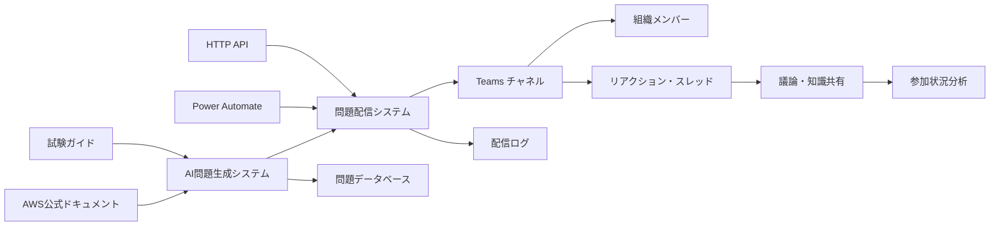

# アーキテクチャ

## システム全体構成



## 主要コンポーネント

### 1. AI 問題生成エンジン

- AWS 公式ドキュメント・試験ガイドからの情報取得
- Professional レベル問題の自動生成
- 品質検証・重複チェック

### 2. Teams 連携システム

- Power Automate による問題配信
- リアクション収集・分析
- スレッド議論の促進

### 3. データ管理システム

- 問題データベース
- 参加状況・学習分析
- 配信ログ・エラー管理

## 技術スタック概要

### AI エージェント基盤

- **エージェントフレームワーク**: Strands Agents (AWS 製オープンソース)
- **実行環境**: AWS Bedrock AgentCore Runtime (Preview)
- **LLM**: Amazon Bedrock (Claude Opus 4, Claude Sonnet 4, Claude 3.7 Sonnet, Claude 3 Haiku)
- **MCP 統合**: Model Context Protocol による標準化されたコンテキスト提供
- **マルチエージェント**: Agent-as-Tools パターンによる専門エージェント連携
- **ストリーミング**: リアルタイム処理状況監視とレスポンス配信

### バックエンド

- **言語**: Python 3.12
- **パッケージ管理**: uv (仮想環境 + 依存関係管理)
- **API**: AgentCore Runtime (AI 処理) + API Gateway + Lambda (外部連携)
- **データベース**: DynamoDB (問題・解析データ)
- **キャッシュ**: DynamoDB TTL + Lambda メモリキャッシュ

### 外部連携・プロトコル

- **MCP (Model Context Protocol)**: 標準化されたコンテキスト提供
- **AWS Documentation MCP Server**: AWS 公式ドキュメント取得 (uvx awslabs.aws-documentation-mcp-server)
- **AWS Knowledge MCP Server**: 試験関連情報取得 (uvx awslabs.aws-knowledge-mcp-server)
- **AWS Pricing MCP Server**: 設計段階でのコスト試算・技術選択支援
- **Power Automate**: Teams 配信用 HTTP API

### インフラ・デプロイ

- **AI 処理**: AWS Bedrock AgentCore Runtime (完全サーバーレス)
- **外部連携 API**: API Gateway REST API (Regional エンドポイント) + Lambda
- **認証**: AgentCore IAM 認証 + API Gateway API Key
- **監視**: AgentCore オブザーバビリティ + CloudWatch Logs + X-Ray トレーシング
- **トリガー**: EventBridge スケジュール → API Gateway → AgentCore Runtime
- **デプロイ**: bedrock-agentcore-starter-toolkit + AWS SAM (ハイブリッド)

## プロジェクト構成（AgentCore 中心設計）

### 統一されたディレクトリ構造

```
aws-exam-agent/
├── app/                          # 全ソースコード集約
│   ├── agentcore/               # AgentCore Runtime用（メイン）
│   │   ├── docker/              # AgentCore デプロイ用
│   │   │   ├── agent_main.py    # メインエージェント（監督者）
│   │   │   ├── requirements.txt # エージェント依存関係
│   │   │   └── agents/          # 専門エージェント
│   │   │       ├── __init__.py
│   │   │       ├── aws_info_agent.py      # AWS情報取得エージェント
│   │   │       ├── question_gen_agent.py  # 問題生成エージェント
│   │   │       └── quality_agent.py       # 品質管理エージェント
│   │   └── mcp/                 # MCP統合
│   │       ├── __init__.py
│   │       ├── mcp_client.py    # MCP Client ラッパー
│   │       └── servers/         # MCP Server 設定
│   │           ├── aws_docs.py
│   │           └── aws_knowledge.py
│   ├── lambda/                  # 補助Lambda関数（最小限）
│   │   ├── __init__.py
│   │   ├── teams_webhook.py     # Teams連携用
│   │   └── scheduler.py         # スケジュール実行用
│   ├── models/                  # データモデル
│   │   ├── __init__.py
│   │   ├── question.py
│   │   ├── delivery.py
│   │   └── user_response.py
│   ├── services/                # ビジネスロジック
│   │   ├── __init__.py
│   │   ├── teams_service.py
│   │   ├── cache_service.py
│   │   └── analytics_service.py
│   └── shared/                  # 共通モジュール
│       ├── __init__.py
│       ├── constants.py
│       ├── exceptions.py
│       └── config.py
├── tests/                       # テストコード
│   ├── unit/
│   ├── integration/
│   └── e2e/
├── infrastructure/              # インフラ定義（最小限）
│   ├── template.yaml           # 補助リソース用SAM
│   └── agentcore-config.yaml   # AgentCore設定
├── scripts/                    # デプロイ・運用スクリプト
│   ├── deploy-agentcore.sh     # AgentCore デプロイ
│   ├── setup-mcp.sh           # MCP環境セットアップ
│   └── test-agents.sh         # エージェントテスト
├── .github/                    # CI/CD
│   └── workflows/
│       ├── test.yml
│       └── deploy-agentcore.yml
├── pyproject.toml             # Python プロジェクト設定
├── README.md
└── WORK_LOG.md
```

### 構成の利点

- **AgentCore 中心**: メイン処理を AgentCore Runtime で実行
- **マルチエージェント対応**: Agent-as-Tools パターンの専門エージェント分離
- **MCP 統合**: 標準化されたコンテキスト提供の明確な分離
- **デプロイ簡素化**: agentcore CLI による簡単デプロイ
- **監視統合**: AgentCore オブザーバビリティの活用
