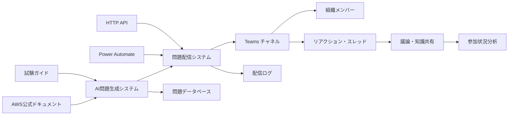

# アーキテクチャ

## システム全体構成



## 主要コンポーネント

### 1. AI 問題生成エンジン

- AWS 公式ドキュメント・試験ガイドからの情報取得
- Professional レベル問題の自動生成
- 品質検証・重複チェック

### 2. Teams 連携システム

- Power Automate による問題配信
- リアクション収集・分析
- スレッド議論の促進

### 3. データ管理システム

- 問題データベース
- 参加状況・学習分析
- 配信ログ・エラー管理

## 技術スタック概要

### AI エージェント基盤

- **エージェントフレームワーク**: Strands Agents (オープンソース)
- **実行環境**: AWS Bedrock AgentCore Runtime (Preview)
- **LLM**: Amazon Bedrock (Claude 4 Sonnet, Claude 3.7 Sonnet)
- **MCP 統合**: 標準化されたコンテキスト提供プロトコル

### バックエンド

- **言語**: Python 3.12
- **パッケージ管理**: uv (仮想環境 + 依存関係管理)
- **API**: API Gateway + Lambda (サーバーレス)
- **データベース**: DynamoDB (問題・解析データ)
- **キャッシュ**: DynamoDB TTL + Lambda メモリキャッシュ

### 外部連携・プロトコル

- **MCP (Model Context Protocol)**: 標準化されたコンテキスト提供
- **AWS Documentation MCP Server**: AWS 公式ドキュメント取得
- **AWS Knowledge MCP Server**: 試験関連情報取得
- **AWS Pricing MCP Server**: 設計段階でのコスト試算・技術選択支援
- **Power Automate**: Teams 配信用 HTTP API

### インフラ・デプロイ

- **API**: API Gateway REST API (Regional エンドポイント)
- **実行環境**: AWS Lambda + Bedrock AgentCore Runtime (完全サーバーレス)
- **認証**: API Gateway API Key + IAM 認証
- **監視**: CloudWatch Logs + X-Ray トレーシング
- **トリガー**: EventBridge スケジュール + API Gateway HTTP API
- **デプロイ**: AWS SAM (Infrastructure as Code)

## プロジェクト構成（app 配下集約）

### 統一されたディレクトリ構造

```
aws-exam-coach/
├── app/                          # 全ソースコード集約
│   ├── lambda/                   # Lambda関数
│   │   ├── __init__.py
│   │   ├── lambda_function.py    # メインハンドラー
│   │   ├── services/             # ビジネスロジック
│   │   │   ├── __init__.py
│   │   │   ├── question_service.py
│   │   │   ├── teams_service.py
│   │   │   └── quality_service.py
│   │   ├── models/               # データモデル
│   │   │   ├── __init__.py
│   │   │   ├── question.py
│   │   │   └── delivery.py
│   │   └── utils/                # ユーティリティ
│   │       ├── __init__.py
│   │       ├── cache.py
│   │       └── logger.py
│   ├── agent/                    # AgentCore用
│   │   ├── __init__.py
│   │   ├── agent_main.py         # メインエージェント
│   │   ├── requirements.txt      # エージェント依存関係
│   │   └── tools/                # エージェント用ツール
│   │       ├── __init__.py
│   │       ├── aws_docs_tool.py
│   │       └── quality_tool.py
│   └── shared/                   # 共通モジュール
│       ├── __init__.py
│       ├── constants.py
│       ├── exceptions.py
│       └── config.py
├── tests/                        # テストコード
│   ├── unit/
│   ├── integration/
│   └── e2e/
├── infrastructure/               # インフラ定義
│   ├── template.yaml            # SAM テンプレート
│   └── iam-roles.yaml          # IAM ロール定義
├── scripts/                     # デプロイ・運用スクリプト
│   ├── deploy-agent.sh
│   └── setup-iam.sh
├── .github/                     # CI/CD
│   └── workflows/
│       ├── test.yml
│       └── deploy.yml
├── pyproject.toml              # Python プロジェクト設定
├── README.md
└── WORK_LOG.md
```

### 構成の利点

- **明確な分離**: Lambda 関数と AgentCore エージェントの明確な分離
- **共通モジュール**: `shared`ディレクトリで効率的なコード管理
- **テスト効率**: `app`配下のみをテスト対象に指定
- **デプロイ簡素化**: パス指定が明確で運用しやすい
