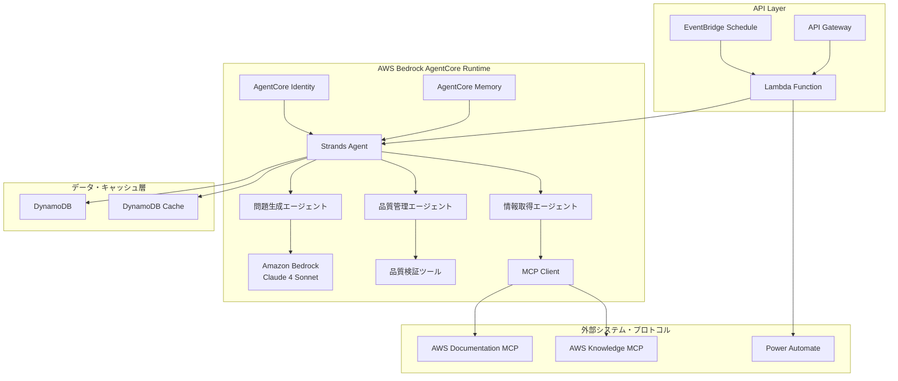
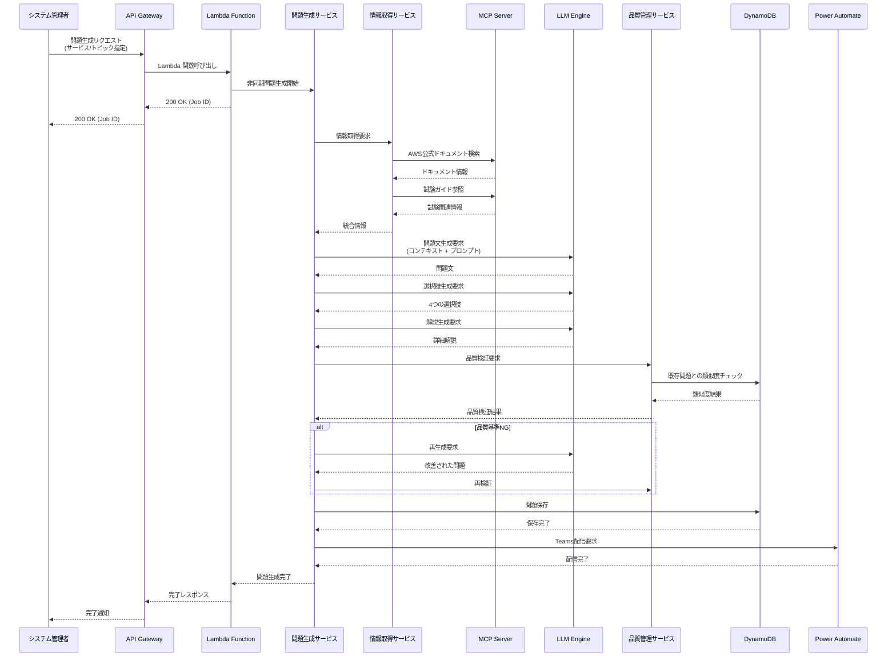
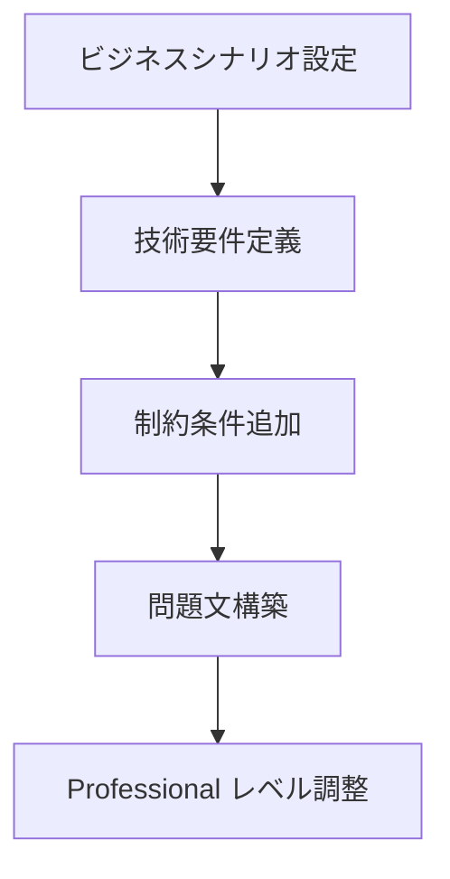

# AI 問題生成エンジン詳細設計

## システム構成 (Bedrock AgentCore + Strands Agents)



## 詳細シーケンス図



## コンポーネント詳細設計

### 1. Strands Agents ベース問題生成エージェント

#### エージェント構成

- **エージェントフレームワーク**: Strands Agents
- **LLM プロバイダー**: Amazon Bedrock (Claude 4 Sonnet)
- **メモリ管理**: AgentCore Memory (短期・長期記憶)
- **情報取得ツール**: MCP 統合による外部情報アクセス

#### 情報取得ツール設計

- **AWS 公式ドキュメントツール**: MCP Server 経由でサービス別ドキュメント取得
- **試験ガイドツール**: 出題範囲・重要トピック情報取得
- **キャッシュ戦略**: 24 時間キャッシュによる効率的な情報取得

#### エージェントプロンプト戦略

```
システムロール: AWS Solutions Architect Professional レベル問題生成専門AI
処理手順:
1. 指定サービス/トピックの最新情報取得
2. ビジネスシナリオベース複合問題作成
3. Professional レベル適合4択選択肢生成
4. 技術的根拠に基づく詳細解説作成
```

実装詳細については [Python コーディング規約](../../../steering/python-coding-standards.md#aws-lambda-固有の規約) を参照してください。

**取得対象:**

- **AWS 公式ドキュメント**: サービス別ユーザーガイド、API リファレンス、ベストプラクティス
- **試験ガイド**: 出題範囲、重要トピック、推奨知識レベル
- **キャッシュ戦略**: 24 時間キャッシュ、差分更新対応

### 2. 問題生成サービス設計

#### サービス構成

- **LLM クライアント**: Amazon Bedrock Claude 統合
- **情報取得サービス**: MCP Server 連携による外部情報取得
- **品質管理サービス**: 自動品質検証・類似度チェック
- **データリポジトリ**: DynamoDB 統合による問題データ管理

#### 処理フロー

```
リクエスト受信 → 情報取得 → プロンプト構築 → LLM生成 → 品質検証 → データ保存
```

#### 品質保証機能

- **再生成機能**: 品質基準未達時の自動再試行（最大 3 回）
- **プロンプト最適化**: Professional レベル要件に基づく動的プロンプト構築
- **エラーハンドリング**: 段階的フォールバック機能

**生成プロンプト構造:**

```
システムロール: AWS Solutions Architect Professional レベル問題生成専門AI
コンテキスト: {MCP経由で取得した最新技術情報}
要求仕様: ビジネスシナリオベース複合問題
制約条件: 4択形式、単一正解、Professional レベル難易度
出力形式: 構造化JSON (問題文、選択肢配列、正解、詳細解説)
```

### 3. 品質管理システム設計

#### 品質検証項目

- **技術的正確性**: AWS 公式情報との整合性確認（95%以上）
- **難易度適正性**: Professional レベル指標スコア（80 点以上）
- **問題明確性**: 曖昧性検出スコア（20%未満）
- **類似度チェック**: 既存問題との重複防止（70%未満）

#### 検証アルゴリズム

- **類似度エンジン**: キーワードベース軽量アルゴリズム
- **バリデーションルール**: Professional レベル要件定義
- **自動判定機能**: 品質基準に基づく合否判定

#### 品質基準

1. **技術的正確性**: AWS 公式情報との整合性 > 95%
2. **難易度適正性**: Professional レベル指標スコア > 80
3. **問題明確性**: 曖昧性検出スコア < 20%
4. **類似度**: 既存問題との類似度 < 70%

**品質基準:**

1. **技術的正確性**: AWS 公式情報との整合性 > 95%
2. **難易度適正性**: Professional レベル指標スコア > 80
3. **問題明確性**: 曖昧性検出スコア < 20%
4. **類似度**: 既存問題との類似度 < 70%

## 問題生成アルゴリズム

### 1. 問題文生成



**生成パターン:**

- **シナリオベース**: 実際の企業環境を想定した複合的な問題
- **ベストプラクティス**: AWS Well-Architected Framework に基づく設計問題
- **トラブルシューティング**: 障害対応・パフォーマンス改善問題

### 2. 選択肢生成

- **正解**: 最適解または推奨されるベストプラクティス
- **不正解**: 説得力があるが不適切な選択肢を 3 つ生成
- **難易度調整**: Professional レベルに適した知識深度

### 3. 解説生成

- **正解理由**: 詳細な技術的根拠と AWS 公式情報への参照
- **不正解理由**: 各選択肢の問題点と改善案
- **関連情報**: 関連する AWS サービス、ベストプラクティス

## 品質管理システム

### 自動品質検証

1. **技術的正確性**: AWS 公式ドキュメントとの整合性確認
2. **難易度適正性**: Professional レベル要件との適合性
3. **問題明確性**: 曖昧さのない明確な問題文
4. **選択肢妥当性**: 適切な難易度の選択肢構成

### 重複チェック

- **類似度計算**: 既存問題との文章類似度分析
- **トピック重複**: 同一サービス・機能の出題頻度管理
- **閾値設定**: 類似度 70%以上で重複判定
