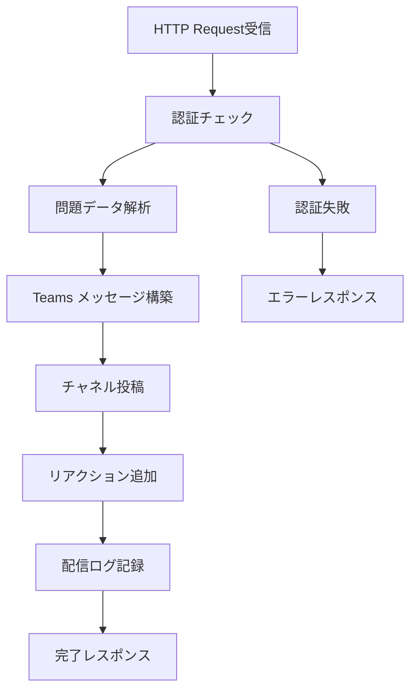
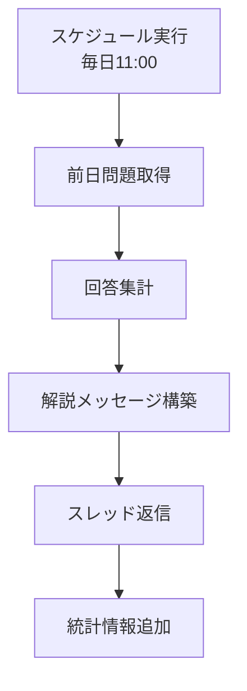
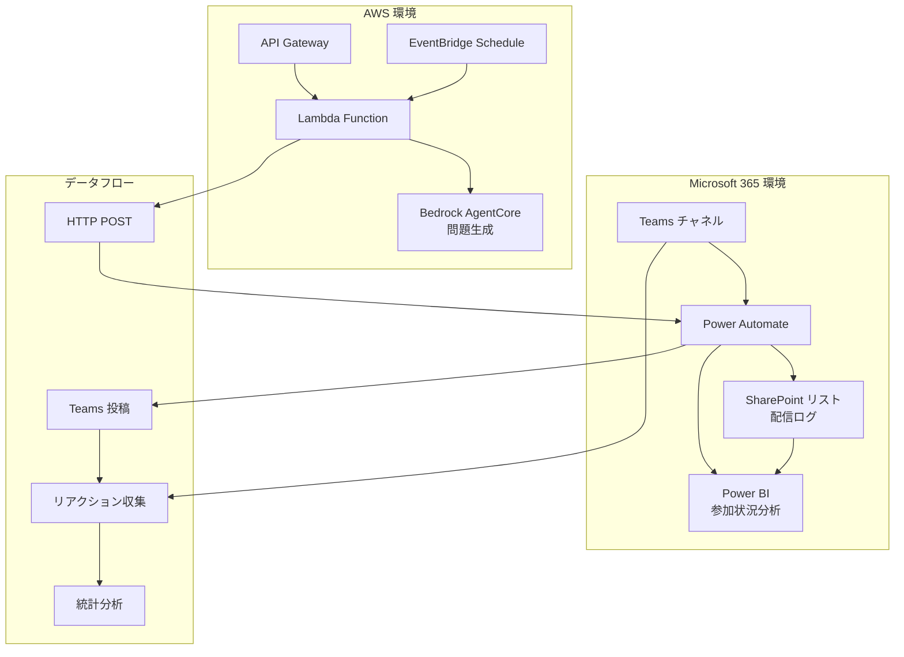

# Teams 連携システム詳細設計

## Power Automate フロー設計

### Power Automate 選択の根拠

- **Teams 統合**: ネイティブな Teams 連携機能
- **運用コスト**: サーバーレス、従量課金モデル
- **開発速度**: ローコード開発による迅速な実装
- **メンテナンス性**: GUI ベースの設定変更が容易
- **Microsoft 365 統合**: 既存環境との親和性が高い

## 1. 問題配信フロー (メインフロー)



### Power Automate フロー構成

```json
{
  "definition": {
    "triggers": [
      {
        "kind": "Http",
        "type": "Request",
        "inputs": {
          "schema": {
            "type": "object",
            "properties": {
              "question_id": { "type": "string" },
              "question_text": { "type": "string" },
              "choices": {
                "type": "array",
                "items": { "type": "string" }
              },
              "correct_answer": { "type": "string" },
              "explanation": { "type": "string" },
              "service": { "type": "string" },
              "difficulty": { "type": "string" }
            }
          }
        }
      }
    ],
    "actions": [
      {
        "type": "Condition",
        "expression": "@equals(triggerBody()?['api_key'], parameters('API_KEY'))",
        "actions": {
          "If_yes": [
            {
              "type": "Microsoft.Teams/PostMessage",
              "inputs": {
                "recipient": {
                  "channelId": "@{parameters('TEAMS_CHANNEL_ID')}"
                },
                "body": {
                  "contentType": "html",
                  "content": "@{variables('formatted_message')}"
                }
              }
            }
          ]
        }
      }
    ]
  }
}
```

## 2. Teams メッセージフォーマット

### 問題投稿テンプレート

```html
<h3>🎯 AWS Solutions Architect Professional 練習問題</h3>
<p>
  <strong>サービス:</strong> @{triggerBody()?['service']} |
  <strong>難易度:</strong> @{triggerBody()?['difficulty']}
</p>

<div
  style="background-color: #f0f8ff; padding: 15px; border-left: 4px solid #0078d4; margin: 10px 0;"
>
  <p><strong>問題:</strong></p>
  <p>@{triggerBody()?['question_text']}</p>
</div>

<p><strong>選択肢:</strong></p>
<p>🅰️ @{triggerBody()?['choices'][0]}</p>
<p>🅱️ @{triggerBody()?['choices'][1]}</p>
<p>🅲️ @{triggerBody()?['choices'][2]}</p>
<p>🅳️ @{triggerBody()?['choices'][3]}</p>

<p>
  💡
  <strong>回答方法:</strong>
  正解だと思う選択肢のリアクション（🅰️🅱️🅲️🅳️）をクリックしてください
</p>
<p>📝 <strong>議論歓迎:</strong> スレッドで解法や考え方をシェアしましょう！</p>

<p><em>問題ID: @{triggerBody()?['question_id']}</em></p>
```

### 自動リアクション追加

```json
{
  "type": "Microsoft.Teams/AddReaction",
  "inputs": {
    "messageId": "@{outputs('PostMessage')?['body/id']}",
    "reactions": [
      { "reactionType": "🅰️" },
      { "reactionType": "🅱️" },
      { "reactionType": "🅲️" },
      { "reactionType": "🅳️" }
    ]
  }
}
```

## 3. 解答公開フロー (24 時間後)



### 解答公開テンプレート

```html
<h3>📊 解答発表 & 解説</h3>

<div
  style="background-color: #e8f5e8; padding: 15px; border-left: 4px solid #28a745; margin: 10px 0;"
>
  <p><strong>正解:</strong> @{variables('correct_answer')} ✅</p>
</div>

<p><strong>回答状況:</strong></p>
<p>🅰️ @{variables('count_A')}名 (@{variables('percent_A')}%)</p>
<p>🅱️ @{variables('count_B')}名 (@{variables('percent_B')}%)</p>
<p>🅲️ @{variables('count_C')}名 (@{variables('percent_C')}%)</p>
<p>🅳️ @{variables('count_D')}名 (@{variables('percent_D')}%)</p>

<div
  style="background-color: #fff3cd; padding: 15px; border-left: 4px solid #ffc107; margin: 10px 0;"
>
  <p><strong>解説:</strong></p>
  <p>@{triggerBody()?['explanation']}</p>
</div>

<p>🎉 正解者: @{variables('correct_users')}</p>
<p>📈 正解率: @{variables('correct_rate')}%</p>
```

## Teams 統合アーキテクチャ

### システム構成図



## データ連携仕様

### 1. 問題配信 API

```python
# リクエスト形式
POST /webhook/teams-delivery
Content-Type: application/json
Authorization: Bearer {API_KEY}

{
    "question_id": "q_20250729_001",
    "question_text": "企業が...",
    "choices": ["選択肢A", "選択肢B", "選択肢C", "選択肢D"],
    "correct_answer": "B",
    "explanation": "正解はBです。理由は...",
    "service": "VPC",
    "difficulty": "Professional",
    "metadata": {
        "generated_at": "2025-07-29T10:00:00Z",
        "source_docs": ["vpc-user-guide", "exam-guide"]
    }
}
```

### 2. 配信結果レスポンス

```json
{
  "status": "success",
  "message_id": "teams_msg_12345",
  "channel_id": "19:abc123@thread.tacv2",
  "posted_at": "2025-07-29T10:05:00Z",
  "reactions_added": ["🅰️", "🅱️", "🅲️", "🅳️"]
}
```

## リアクション分析システム

### 1. リアクション収集

```json
{
  "type": "Microsoft.Teams/GetReactions",
  "inputs": {
    "messageId": "@{variables('message_id')}",
    "runAfter": {
      "Delay": ["Succeeded"]
    }
  }
}
```

### 2. 統計計算

```javascript
// Power Automate 式
{
  "total_responses": "@length(outputs('GetReactions')?['body/value'])",
  "correct_count": "@length(filter(outputs('GetReactions')?['body/value'], equals(item()?['reactionType'], variables('correct_answer'))))",
  "correct_rate": "@div(mul(variables('correct_count'), 100), variables('total_responses'))"
}
```

### 3. SharePoint ログ記録

**配信ログリスト構造:**

| 列名             | 型             | 説明                |
| ---------------- | -------------- | ------------------- |
| QuestionID       | 単一行テキスト | 問題識別子          |
| PostedDate       | 日付と時刻     | 配信日時            |
| Service          | 選択肢         | AWS サービス名      |
| Difficulty       | 選択肢         | 難易度レベル        |
| MessageID        | 単一行テキスト | Teams メッセージ ID |
| TotalResponses   | 数値           | 総回答数            |
| CorrectResponses | 数値           | 正解数              |
| CorrectRate      | 数値           | 正解率(%)           |
| ResponseDetails  | 複数行テキスト | 回答詳細(JSON)      |

## エラーハンドリング (Teams 連携)

### 1. 配信失敗時の処理

```json
{
  "type": "Scope",
  "actions": {
    "Try": [{ "type": "Microsoft.Teams/PostMessage" }]
  },
  "runAfter": {},
  "trackedProperties": {
    "question_id": "@triggerBody()?['question_id']"
  },
  "catch": {
    "actions": [
      {
        "type": "Microsoft.Teams/PostMessage",
        "inputs": {
          "body": {
            "content": "⚠️ 問題配信でエラーが発生しました。管理者に連絡してください。"
          }
        }
      },
      {
        "type": "Http",
        "inputs": {
          "method": "POST",
          "uri": "@parameters('ERROR_WEBHOOK_URL')",
          "body": {
            "error": "@outputs('PostMessage')?['body']",
            "question_id": "@triggerBody()?['question_id']"
          }
        }
      }
    ]
  }
}
```

### 2. リアクション取得失敗

```json
{
  "type": "Condition",
  "expression": "@greater(outputs('GetReactions')?['statusCode'], 299)",
  "actions": {
    "If_yes": [
      {
        "type": "Microsoft.Teams/PostMessage",
        "inputs": {
          "body": {
            "content": "📊 回答集計中にエラーが発生しました。手動で確認をお願いします。"
          }
        }
      }
    ]
  }
}
```
