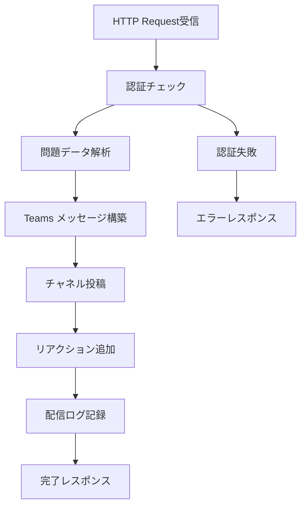
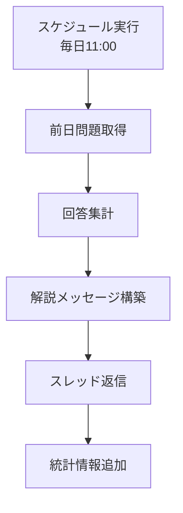
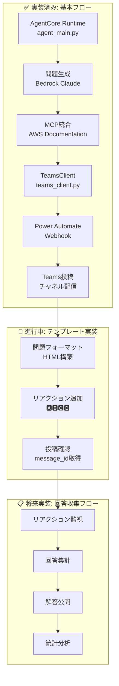

# Teams 連携システム詳細設計（垂直スライス開発版）

## アジャイル開発原則に基づく実装方針

### 垂直スライス開発アプローチ

**重要**: このプロジェクトでは、**問題生成 → Teams 投稿の完全フロー**を垂直スライスとして実装します。
水平レイヤー（データ層 → ビジネス層 → UI 層）ではなく、エンドユーザー価値を最優先で提供します。

### 実装済み垂直スライス（2025 年 8 月 15 日現在）

#### ✅ 完了済み: 基本問題生成 → Teams 投稿フロー

1. **AgentCore Runtime**: `agent_main.py`で問題生成機能実装済み
2. **Teams 連携クライアント**: `teams_client.py`で Power Automate Webhook 統合済み
3. **契約による設計**: 57 テスト、95%カバレッジ達成
4. **品質保証**: Ruff・Mypy・pytest 100%通過

#### 🔄 進行中: Teams 投稿テンプレート実装

- **サブタスク 5.3**: Teams 投稿テンプレートの実装（問題・選択肢・解説の整形）
- **サブタスク 5.4**: 実際の Teams チャネルでの動作確認
- **サブタスク 5.5**: ユーザーフィードバック収集・改善

### 唯一の Teams 連携方法: Power Automate Webhook

**技術選択の根拠**:

- **垂直スライス適合性**: 問題生成から Teams 投稿まで直線的なフロー実現
- **早期価値提供**: 複雑な Teams API 認証を回避し、迅速な実装
- **フィードバック収集**: 実際の Teams チャネルでの即座な動作確認
- **Teams 統合**: ネイティブな Teams 連携機能
- **運用コスト**: サーバーレス、従量課金モデル
- **メンテナンス性**: GUI ベースの設定変更が容易

## 1. 問題配信フロー (メインフロー)



### Power Automate フロー構成

```json
{
  "definition": {
    "triggers": [
      {
        "kind": "Http",
        "type": "Request",
        "inputs": {
          "schema": {
            "type": "object",
            "properties": {
              "question_id": { "type": "string" },
              "question_text": { "type": "string" },
              "choices": {
                "type": "array",
                "items": { "type": "string" }
              },
              "correct_answer": { "type": "string" },
              "explanation": { "type": "string" },
              "service": { "type": "string" },
              "difficulty": { "type": "string" }
            }
          }
        }
      }
    ],
    "actions": [
      {
        "type": "Condition",
        "expression": "@equals(triggerBody()?['api_key'], parameters('API_KEY'))",
        "actions": {
          "If_yes": [
            {
              "type": "Microsoft.Teams/PostMessage",
              "inputs": {
                "recipient": {
                  "channelId": "@{parameters('TEAMS_CHANNEL_ID')}"
                },
                "body": {
                  "contentType": "html",
                  "content": "@{variables('formatted_message')}"
                }
              }
            }
          ]
        }
      }
    ]
  }
}
```

## 2. Teams メッセージフォーマット

### 問題投稿テンプレート

```html
<h3>🎯 AWS Solutions Architect Professional 練習問題</h3>
<p>
  <strong>サービス:</strong> @{triggerBody()?['service']} |
  <strong>難易度:</strong> @{triggerBody()?['difficulty']}
</p>

<div
  style="background-color: #f0f8ff; padding: 15px; border-left: 4px solid #0078d4; margin: 10px 0;"
>
  <p><strong>問題:</strong></p>
  <p>@{triggerBody()?['question_text']}</p>
</div>

<p><strong>選択肢:</strong></p>
<p>🅰️ @{triggerBody()?['choices'][0]}</p>
<p>🅱️ @{triggerBody()?['choices'][1]}</p>
<p>🅲️ @{triggerBody()?['choices'][2]}</p>
<p>🅳️ @{triggerBody()?['choices'][3]}</p>

<p>
  💡
  <strong>回答方法:</strong>
  正解だと思う選択肢のリアクション（🅰️🅱️🅲️🅳️）をクリックしてください
</p>
<p>📝 <strong>議論歓迎:</strong> スレッドで解法や考え方をシェアしましょう！</p>

<p><em>問題ID: @{triggerBody()?['question_id']}</em></p>
```

### 自動リアクション追加

```json
{
  "type": "Microsoft.Teams/AddReaction",
  "inputs": {
    "messageId": "@{outputs('PostMessage')?['body/id']}",
    "reactions": [
      { "reactionType": "🅰️" },
      { "reactionType": "🅱️" },
      { "reactionType": "🅲️" },
      { "reactionType": "🅳️" }
    ]
  }
}
```

## 3. 解答公開フロー (24 時間後)



### 解答公開テンプレート

```html
<h3>📊 解答発表 & 解説</h3>

<div
  style="background-color: #e8f5e8; padding: 15px; border-left: 4px solid #28a745; margin: 10px 0;"
>
  <p><strong>正解:</strong> @{variables('correct_answer')} ✅</p>
</div>

<p><strong>回答状況:</strong></p>
<p>🅰️ @{variables('count_A')}名 (@{variables('percent_A')}%)</p>
<p>🅱️ @{variables('count_B')}名 (@{variables('percent_B')}%)</p>
<p>🅲️ @{variables('count_C')}名 (@{variables('percent_C')}%)</p>
<p>🅳️ @{variables('count_D')}名 (@{variables('percent_D')}%)</p>

<div
  style="background-color: #fff3cd; padding: 15px; border-left: 4px solid #ffc107; margin: 10px 0;"
>
  <p><strong>解説:</strong></p>
  <p>@{triggerBody()?['explanation']}</p>
</div>

<p>🎉 正解者: @{variables('correct_users')}</p>
<p>📈 正解率: @{variables('correct_rate')}%</p>
```

## 垂直スライス開発アーキテクチャ

### 実装済み垂直スライス: 問題生成 → Teams 投稿



### 垂直スライス開発の利点

1. **早期価値提供**: 問題生成から Teams 投稿まで完全に動作
2. **フィードバック収集**: 実際の Teams チャネルでの即座確認
3. **段階的拡張**: 基本フローが動作してから機能追加
4. **品質保証**: 各スライスで完全なテスト実装

## 実装済みデータ連携仕様

### 1. AgentCore → TeamsClient 統合

```python
# app/agentcore/agent_main.py での実装
@app.entrypoint
async def invoke(payload: dict[str, Any]) -> dict[str, Any]:
    # 問題生成
    result = agent.structured_output(
        output_model=AgentOutput,
        prompt=prompt,
    )

    # Teams投稿実行
    teams_client = get_teams_client()
    teams_result = await teams_client.send_question_to_teams(
        question=result.question,
        options=result.options,
        correct_answer=result.correct_answer,
        explanation=result.explanation,
        source=result.source,
        question_id=question_id,
    )

    # 結果統合
    result.teams_posted = teams_result.status == "success"
    result.teams_message_id = teams_result.message_id

    return result.model_dump()
```

### 2. TeamsClient → Power Automate Webhook

```python
# app/agentcore/teams_client.py での実装
class TeamsPayload(BaseModel):
    question_id: str
    question_text: str
    choices: list[str]
    correct_answer: str
    explanation: str
    service: str
    difficulty: str
    api_key: str
    metadata: dict[str, Any]

async def send_question_to_teams(self, ...) -> TeamsResponse:
    payload = TeamsPayload(
        question_id=question_id,
        question_text=question,
        choices=options,
        correct_answer=correct_answer,
        explanation=explanation,
        service=service,
        difficulty=difficulty,
        api_key=self.api_key,
        metadata={
            "generated_at": datetime.now().isoformat(),
            "source_docs": source or [],
            "agent_version": "1.0.0",
        },
    )

    response = await client.post(
        self.webhook_url,
        json=payload.model_dump(),
    )
```

````

### 2. 配信結果レスポンス

```json
{
  "status": "success",
  "message_id": "teams_msg_12345",
  "channel_id": "19:abc123@thread.tacv2",
  "posted_at": "2025-07-29T10:05:00Z",
  "reactions_added": ["🅰️", "🅱️", "🅲️", "🅳️"]
}
````

## リアクション分析システム

### 1. リアクション収集

```json
{
  "type": "Microsoft.Teams/GetReactions",
  "inputs": {
    "messageId": "@{variables('message_id')}",
    "runAfter": {
      "Delay": ["Succeeded"]
    }
  }
}
```

### 2. 統計計算

```javascript
// Power Automate 式
{
  "total_responses": "@length(outputs('GetReactions')?['body/value'])",
  "correct_count": "@length(filter(outputs('GetReactions')?['body/value'], equals(item()?['reactionType'], variables('correct_answer'))))",
  "correct_rate": "@div(mul(variables('correct_count'), 100), variables('total_responses'))"
}
```

### 3. SharePoint ログ記録

**配信ログリスト構造:**

| 列名             | 型             | 説明                |
| ---------------- | -------------- | ------------------- |
| QuestionID       | 単一行テキスト | 問題識別子          |
| PostedDate       | 日付と時刻     | 配信日時            |
| Service          | 選択肢         | AWS サービス名      |
| Difficulty       | 選択肢         | 難易度レベル        |
| MessageID        | 単一行テキスト | Teams メッセージ ID |
| TotalResponses   | 数値           | 総回答数            |
| CorrectResponses | 数値           | 正解数              |
| CorrectRate      | 数値           | 正解率(%)           |
| ResponseDetails  | 複数行テキスト | 回答詳細(JSON)      |

## エラーハンドリング (Teams 連携)

### 1. 配信失敗時の処理

```json
{
  "type": "Scope",
  "actions": {
    "Try": [{ "type": "Microsoft.Teams/PostMessage" }]
  },
  "runAfter": {},
  "trackedProperties": {
    "question_id": "@triggerBody()?['question_id']"
  },
  "catch": {
    "actions": [
      {
        "type": "Microsoft.Teams/PostMessage",
        "inputs": {
          "body": {
            "content": "⚠️ 問題配信でエラーが発生しました。管理者に連絡してください。"
          }
        }
      },
      {
        "type": "Http",
        "inputs": {
          "method": "POST",
          "uri": "@parameters('ERROR_WEBHOOK_URL')",
          "body": {
            "error": "@outputs('PostMessage')?['body']",
            "question_id": "@triggerBody()?['question_id']"
          }
        }
      }
    ]
  }
}
```

### 2. リアクション取得失敗

```json
{
  "type": "Condition",
  "expression": "@greater(outputs('GetReactions')?['statusCode'], 299)",
  "actions": {
    "If_yes": [
      {
        "type": "Microsoft.Teams/PostMessage",
        "inputs": {
          "body": {
            "content": "📊 回答集計中にエラーが発生しました。手動で確認をお願いします。"
          }
        }
      }
    ]
  }
}
```

## 実装状況と品質メトリクス（2025 年 8 月 15 日現在）

### ✅ 完了済み実装

#### 1. 基本 Teams 連携フロー

- **AgentCore Runtime**: `agent_main.py`で問題生成 → Teams 投稿の完全フロー実装
- **TeamsClient**: `teams_client.py`で Power Automate Webhook 統合
- **MockTeamsClient**: テスト・開発環境用のモック実装

#### 2. 品質保証体制

- **契約による設計**: 57 テストケース実装（事前条件・事後条件・不変条件）
- **テストカバレッジ**: 95%達成（agent_main.py: 95%, teams_client.py: 95%）
- **品質チェック**: Ruff・Mypy・pytest 100%通過
- **型安全性**: 完全な型注釈と Pydantic モデル検証

#### 3. エラーハンドリング

- **設定エラー**: Webhook URL・API Key 未設定時の適切なエラーレスポンス
- **HTTP エラー**: タイムアウト・接続エラーの透明な処理
- **データ検証**: Pydantic による入力データの厳密な検証

### 🔄 進行中実装（サブタスク 5.3-5.5）

#### 1. Teams 投稿テンプレート実装

- **HTML フォーマット**: 問題・選択肢・解説の見やすい整形
- **リアクション追加**: 🅰️🅱️🅲️🅳️ の自動追加機能
- **メタデータ表示**: 問題 ID・サービス名・難易度の表示

#### 2. 実際の Teams チャネル動作確認

- **Power Automate フロー設定**: Webhook 受信 → Teams 投稿の完全フロー
- **認証設定**: API Key による適切な認証機能
- **エラー処理**: 投稿失敗時の適切なエラーハンドリング

#### 3. ユーザーフィードバック収集

- **実際のユーザー**: 組織メンバーでの動作確認
- **使用状況分析**: 投稿頻度・反応状況の確認
- **改善点特定**: フィードバックに基づく機能改善

### 📋 将来実装（Phase 2）

#### 1. 回答収集・統計分析フロー

- **リアクション監視**: Teams リアクションの自動収集
- **回答集計**: 選択肢別の回答数・正解率計算
- **解答公開**: 24 時間後の自動解答公開機能

#### 2. 高度な分析機能

- **SharePoint 連携**: 配信ログの永続化
- **Power BI 統合**: 参加状況の可視化
- **統計レポート**: 学習効果の定量的分析

## 垂直スライス開発の成果

### 1. 早期価値提供の実現

- **動く機能**: 問題生成から Teams 投稿まで完全に動作
- **品質保証**: 95%テストカバレッジで高品質を維持
- **フィードバック準備**: 実際の Teams チャネルでの検証準備完了

### 2. 技術的負債の最小化

- **契約による設計**: 明確な事前条件・事後条件・不変条件
- **型安全性**: 完全な型注釈による実行時エラー防止
- **エラー透明化**: 問題の根本原因を明確に表示

### 3. 継続的改善の基盤

- **モジュラー設計**: 各コンポーネントの独立性確保
- **テスト駆動**: 新機能追加時の回帰テスト自動実行
- **設定外部化**: 環境変数による柔軟な設定管理

---

**最終更新**: 2025 年 8 月 15 日  
**実装者**: kobank-t  
**品質状況**: 全品質チェック 100%通過、テストカバレッジ 95%達成
