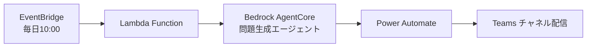
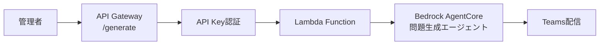
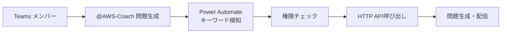

# デプロイメント設計

## Bedrock AgentCore デプロイ設計

### starter-toolkit を活用したデプロイ戦略

#### 1. エージェント実装構成（app/agent 配下）

**ファイル構成:**

```
app/agent/
├── agent_main.py          # メインエントリーポイント
├── config/
│   ├── agent_config.py    # エージェント設定
│   └── prompts.py         # プロンプトテンプレート
└── tools/
    ├── aws_docs_tool.py   # AWS文書取得ツール
    └── exam_guide_tool.py # 試験ガイドツール
```

**主要コンポーネント:**

- **BedrockAgentCoreApp**: エージェント実行環境
- **Strands Agent**: 問題生成エージェント本体
- **MCP Tools**: 外部情報取得ツール群
- **共通モジュール**: app/shared 配下の共通機能

**処理フロー:**

```
ペイロード受信 → 設定読み込み → エージェント初期化 →
問題生成実行 → レスポンス構築 → 結果返却
```

実装詳細については [Python コーディング規約](../../../steering/python-coding-standards.md#aws-lambda-固有の規約) を参照してください。

#### 2. 共通設定構成（app/shared/config.py）

**設定クラス構成:**

- **AgentConfig**: エージェント固有設定（モデル名、プロンプトテンプレート）
- **LambdaConfig**: Lambda 環境設定（テーブル名、ARN、ログレベル）
- **MCPConfig**: MCP Server 接続設定

**主要設定項目:**

- **LLM モデル**: Claude Sonnet 4 (anthropic.claude-sonnet-4-20250514-v1:0)
- **デフォルト値**: サービス=EC2、トピック=VPC
- **出力形式**: 構造化 JSON（問題文、選択肢、正解、解説）
- **環境変数**: DynamoDB テーブル名、AgentCore Runtime ARN

設定の具体的な実装については [Python コーディング規約](../../../steering/python-coding-standards.md#環境変数設定管理) を参照してください。

#### 3. デプロイスクリプト（scripts/deploy-agent.sh）

```bash
#!/bin/bash
# scripts/deploy-agent.sh

set -e

# プロジェクトルートに移動
cd "$(dirname "$0")/.."

echo "🚀 Deploying Bedrock AgentCore Agent..."

# 1. エージェントディレクトリに移動
cd app/agent/

# 2. starter-toolkit でデプロイ
agentcore configure --entrypoint agent_main.py -er arn:aws:iam::${AWS_ACCOUNT_ID}:role/BedrockAgentCoreExecutionRole
agentcore launch

echo "✅ Agent deployment completed!"

# 3. プロジェクトルートに戻る
cd ../..

# 4. 補助インフラ SAM デプロイ（API Gateway + Lambda）
echo "🚀 Deploying API Gateway and Lambda..."
cd infrastructure/
sam build
sam deploy --no-confirm-changeset --no-fail-on-empty-changeset \
  --stack-name aws-exam-agent-api \
  --s3-bucket ${AWS_SAM_DEPLOYMENT_BUCKET} \
  --capabilities CAPABILITY_IAM \
  --parameter-overrides \
    AgentRuntimeArn=${AGENT_RUNTIME_ARN} \
    ApiKeyValue=${API_KEY}

echo "✅ Hybrid deployment completed!"
```

#### 4. Lambda 統合設計（app/lambda/lambda_function.py）

**Lambda 関数の責務（外部連携専用）:**

- **リクエスト解析**: API Gateway / EventBridge からの入力処理
- **AgentCore 呼び出し**: Bedrock AgentCore Runtime への問題生成依頼
- **レスポンス処理**: AgentCore からの結果受信・構造化
- **Teams 配信**: Power Automate 経由での問題配信
- **エラーハンドリング**: AgentCore 呼び出し失敗時の処理

**処理フロー:**

```
Lambda起動 → リクエスト解析 → AgentCoreペイロード構築 →
AgentCore呼び出し → レスポンス処理 → Teams配信 → 結果返却
```

**統合ポイント:**

- **Bedrock AgentCore Client**: boto3 経由での AgentCore Runtime 呼び出し
- **セッション管理**: AWS Request ID ベースのセッション識別
- **エラーハンドリング**: 段階的エラー処理とログ出力
- **Teams 統合**: 既存 TeamsService との連携

Lambda 関数の具体的な実装については [Python コーディング規約](../../../steering/python-coding-standards.md#aws-lambda-固有の規約) を参照してください。

## 問題生成トリガー設計

### トリガー方法一覧

#### 1. スケジュール自動実行 (推奨・MVP)



**実装:**

```python
# EventBridge Rule
{
    "ScheduleExpression": "cron(0 10 * * ? *)",  # 毎日10:00 JST
    "Target": "QuestionGeneratorLambda"
}

# Lambda Function (トリガー用)
import boto3

def lambda_handler(event, context):
    # Bedrock AgentCore Runtime 呼び出し
    response = bedrock_agent_runtime.invoke_agent(
        agentId="question-generator-agent",
        sessionId=f"daily-{datetime.now().strftime('%Y%m%d')}",
        inputText="今日の問題を生成してください"
    )
    return {"statusCode": 200}
```

#### 2. API Gateway エンドポイント (手動実行用)



**実装:**

```python
# Lambda Function Handler
import json
import boto3
import os
from datetime import datetime

def lambda_handler(event, context):
    """API Gateway + EventBridge 両対応のハンドラー"""
    try:
        # API Gateway からのリクエスト
        if 'httpMethod' in event:
            return handle_api_request(event, context)

        # EventBridge からのスケジュール実行
        if event.get('source') == 'aws.events':
            return handle_scheduled_execution(event, context)

    except Exception as e:
        return {
            'statusCode': 500,
            'body': json.dumps({'error': str(e)})
        }

def handle_api_request(event, context):
    """API Gateway リクエスト処理"""
    # API Key 認証
    api_key = event['headers'].get('x-api-key')
    if api_key != os.environ['API_KEY']:
        return {'statusCode': 401, 'body': 'Unauthorized'}

    body = json.loads(event['body'])

    # Bedrock AgentCore 呼び出し
    bedrock_agent = boto3.client('bedrock-agent-runtime')
    response = bedrock_agent.invoke_agent(
        agentId=os.environ['AGENT_ID'],
        sessionId=f"api-{datetime.now().isoformat()}",
        inputText=f"Generate question for {body['service']} - {body['topic']}"
    )

    return {
        'statusCode': 200,
        'headers': {'Content-Type': 'application/json'},
        'body': json.dumps({'job_id': response['sessionId']})
    }

# 使用例
curl -X POST "https://api.example.com/generate" \
  -H "x-api-key: your-secret-key" \
  -H "Content-Type: application/json" \
  -d '{"topic": "VPC", "service": "EC2"}'
```

#### 3. Teams コマンド (ユーザーフレンドリー)



**実装:**

```json
// Power Automate フロー
{
  "trigger": {
    "type": "teams_message_posted",
    "condition": "contains(@AWS-Coach 問題生成)"
  },
  "actions": [
    {
      "type": "condition",
      "expression": "triggerBody().from.userPrincipalName in ['admin1@company.com', 'admin2@company.com']"
    },
    {
      "type": "http_request",
      "method": "POST",
      "uri": "https://api.example.com/api/generate",
      "headers": { "api-key": "@{parameters('API_KEY')}" }
    }
  ]
}
```

### 推奨実装順序 (Power Automate 中心アプローチ)

1. **Phase 1 (MVP)**: API Gateway + Lambda 基本実装

   - SAM CLI での基本動作確認・テスト
   - 問題生成 → Teams 配信の基本フロー確立
   - API Gateway API Key 認証

2. **Phase 2**: EventBridge スケジュール実行

   - EventBridge Rule による定期実行 (毎日 10:00)
   - 同一 Lambda 関数での API + スケジュール両対応
   - 完全自動化された問題配信

3. **Phase 3**: インタラクティブ実行
   - Teams コマンドでの手動実行
   - Power Automate から API Gateway 呼び出し
   - より柔軟な問題生成オプション

### セキュリティ考慮事項

- **API Key**: API Gateway Usage Plan で管理、定期ローテーション
- **IAM 権限**: Lambda 実行ロールの最小権限原則
- **レート制限**: API Gateway Usage Plan でスロットリング設定
- **ログ監視**: CloudWatch Logs + X-Ray トレーシング
- **VPC**: 必要に応じて Lambda を VPC 内に配置
- **暗号化**: DynamoDB 保存時暗号化、API Gateway TLS 1.2

## デプロイ手順

### Phase 1: 手動デプロイ（学習重視）

1. `bedrock-agentcore-starter-toolkit` インストール
2. IAM ロール作成（BedrockAgentCoreExecutionRole）
3. エージェントコード実装（app/agent/）
4. starter-toolkit でのデプロイ実行
5. Lambda 関数からの統合テスト

### Phase 2: CI/CD 統合（将来拡張）

1. GitHub Actions ワークフロー追加
2. 自動デプロイパイプライン構築
3. 監視・アラート設定

## 学習ポイント

この設計により以下の AWS サービスを実践的に学習できます：

- **Bedrock AgentCore**: 最新の AI エージェント実行環境
- **starter-toolkit**: 公式ツールによる効率的なデプロイ
- **コンテナ化**: ECR を使ったアプリケーション配布
- **サーバーレス統合**: Lambda ↔ AgentCore 連携
- **Infrastructure as Code**: SAM によるリソース管理
