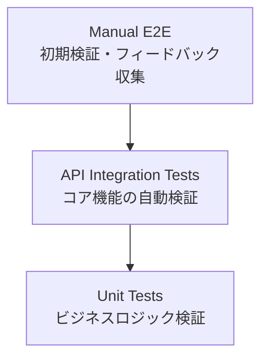

# テスト戦略

## 学習重視のテスト戦略概要

### 実用的テストピラミッド



### フェーズ別テスト方針

#### Phase 1: MVP リリース（最小限のテスト）

1. **Unit Tests (60%)**: ビジネスロジックの基本動作確認
2. **API Integration Tests (30%)**: 重要な API エンドポイント確認
3. **Manual E2E (10%)**: 手動での動作確認・ユーザーフィードバック収集

#### Phase 2: フィードバック反映後（自動化拡充）

- ユーザーフィードバックに基づく自動テスト追加
- 頻繁に発生する問題の自動検証
- CI/CD パイプライン強化

## Phase 1: MVP 向け最小限テスト

### 1. Unit Tests（純粋な単体テスト）

**対象**: 外部依存のない純粋なロジック

**テスト対象の選定原則**:

- **app/配下のソースファイルと対となるロジック**をテスト対象とする
- **外部依存なし**：moto、boto3 等の外部ライブラリを使用しない
- **高速実行**：1 テストあたり 1-10ms、100 テスト実行でも 1 秒以内
- **明確な失敗原因**：ビジネスロジック以外の要因で失敗しない

**具体的なテスト対象**:

- **データ変換ロジック**：DynamoDB ↔ モデル変換（`_to_model`, `_from_model`）
- **バリデーション関数**：入力データの妥当性チェック
- **計算ロジック**：統計計算、スコア算出等の純粋関数
- **列挙型変換**：文字列 ↔ Enum 変換ロジック
- **日時変換**：ISO 文字列 ↔ datetime 変換ロジック

```python
# ✅ 適切な単体テスト - データ変換ロジック
def test_user_response_to_model_conversion():
    """DynamoDBアイテム → UserResponseモデル変換ロジック"""
    repository = UserResponseRepository("dummy-table")

    # 入力データ（DynamoDBアイテム形式）
    item = {
        "delivery_id": "d001",
        "user_id": "u001",
        "user_name": "テストユーザー",
        "selected_answer": "A",
        "is_correct": True,
        "reaction_type": "🅰️",
        "responded_at": "2025-08-11T15:30:00+00:00"
    }

    # 変換実行（外部依存なし）
    result = repository._to_model(item)

    # 変換ロジックの検証
    assert result.delivery_id == "d001"
    assert result.user_id == "u001"
    assert result.reaction_type == ReactionType.A
    assert isinstance(result.responded_at, datetime)

# ✅ 適切な単体テスト - バリデーション関数
def test_question_text_validation():
    """問題文バリデーションロジック"""
    # 正常ケース
    valid_text = "これは10文字以上の有効な問題文です"
    assert validate_question_text(valid_text) is True

    # 異常ケース
    invalid_text = "短い"
    assert validate_question_text(invalid_text) is False

# ✅ 適切な単体テスト - 計算ロジック
def test_correct_rate_calculation():
    """正解率計算ロジック"""
    # 正常ケース
    assert calculate_correct_rate(7, 10) == Decimal("0.7")
    assert calculate_correct_rate(0, 10) == Decimal("0.0")
    assert calculate_correct_rate(10, 10) == Decimal("1.0")

    # 境界値ケース
    assert calculate_correct_rate(0, 0) == Decimal("0.0")  # ゼロ除算対応
```

**実行例**:

```bash
# 高速実行（外部依存なし）
uv run pytest tests/unit/ -v
# 50 tests in 0.5s (1テストあたり約10ms)
```

### 2. Integration Tests（統合テスト）

**対象**: 実際のユースケース・ビジネスフロー

**統合テストの設計原則**:

- **ユースケース単位**でテストを設計（リポジトリクラス単位ではない）
- **複数コンポーネント連携**を検証
- **実際のビジネス価値**を持つフローをテスト
- `@pytest.mark.integration` マーカーを必須とする
- moto を使用して AWS 環境をモック化

**ファイル構成**:

- `test_question_delivery_flow.py`: 問題配信フロー全体
- `test_response_collection_flow.py`: 回答収集・統計計算フロー
- `test_data_consistency.py`: データ整合性確保
- `test_repository_performance.py`: パフォーマンス・制限テスト

```python
# ✅ 適切な統合テスト - 実際のユースケース
@pytest.mark.integration
@mock_aws
async def test_complete_question_delivery_flow():
    """
    ユースケース：問題配信から回答収集、統計計算までの完全フロー

    シナリオ：
    1. 管理者が新しい問題を作成
    2. 問題を配信開始
    3. 複数ユーザーが回答
    4. 統計を計算して配信結果を更新
    5. 全体の整合性を確認
    """
    # 複数リポジトリを使用（実際のユースケースでは複数コンポーネントが連携）
    question_repo = QuestionRepository("test-table")
    delivery_repo = DeliveryRepository("test-table")
    response_repo = UserResponseRepository("test-table")

    # 1. 問題作成（管理者のユースケース）
    question = Question(
        service=AWSService.EC2,
        question_text="Amazon VPCの特徴として正しいものはどれですか？",
        choices=["A: 仮想プライベートクラウド環境を提供する", ...],
        correct_answer="A"
    )
    created_question = await question_repo.create_question(question)

    # 2. 配信開始（管理者のユースケース）
    delivery = Delivery(question_id=created_question.question_id, status=DeliveryStatus.POSTED)
    created_delivery = await delivery_repo.create_delivery(delivery)

    # 3. 複数ユーザーが回答（エンドユーザーのユースケース）
    user_responses = [
        UserResponse(delivery_id=created_delivery.delivery_id, user_id="user1", selected_answer="A", is_correct=True),
        UserResponse(delivery_id=created_delivery.delivery_id, user_id="user2", selected_answer="B", is_correct=False),
        # ...
    ]

    for response in user_responses:
        await response_repo.create_user_response(response)

    # 4. 統計計算（システムのユースケース）
    all_responses = await response_repo.get_responses_by_delivery(created_delivery.delivery_id)
    correct_count = sum(1 for r in all_responses if r.is_correct)
    total_count = len(all_responses)

    await delivery_repo.update_response_stats(
        created_delivery.delivery_id,
        total_responses=total_count,
        correct_responses=correct_count,
        correct_rate=Decimal(str(correct_count / total_count))
    )

    # 5. 全体の整合性確認（品質保証のユースケース）
    final_delivery = await delivery_repo.get_delivery(created_delivery.delivery_id)
    assert final_delivery.total_responses == len(user_responses)
    assert final_delivery.correct_responses == correct_count

# ✅ 適切な統合テスト - データ整合性
@pytest.mark.integration
@mock_aws
async def test_delivery_response_consistency():
    """データ整合性統合テスト：配信と回答データの整合性確認"""
    delivery_repo = DeliveryRepository("test-table")
    response_repo = UserResponseRepository("test-table")

    # 配信作成
    delivery = Delivery(question_id="q001", status=DeliveryStatus.POSTED)
    created_delivery = await delivery_repo.create_delivery(delivery)

    # 回答作成
    response = UserResponse(delivery_id=created_delivery.delivery_id, user_id="user1", selected_answer="A", is_correct=True)
    await response_repo.create_user_response(response)

    # 整合性確認：配信に対応する回答が存在する
    delivery_responses = await response_repo.get_responses_by_delivery(created_delivery.delivery_id)
    assert len(delivery_responses) == 1
    assert delivery_responses[0].delivery_id == created_delivery.delivery_id
```

**実行例**:

```bash
# 統合テスト実行（moto使用、実際のユースケース検証）
uv run pytest tests/integration/ -v
# 10 tests in 15s (1テストあたり約1.5秒)
```

**テスト実装の詳細**: [Python コーディング規約](../../../steering/python-coding-standards.md#テスト) を参照してください。

### 3. Manual E2E（手動検証）

**対象**: ユーザー体験の基本フロー

**手動確認チェックリスト:**

1. **問題生成 → Teams 配信フロー**

   - [ ] API Gateway 経由で問題生成リクエスト送信
   - [ ] Power Automate 経由で Teams チャネルに問題投稿
   - [ ] 問題文・選択肢が正しく表示される

2. **リアクション収集**

   - [ ] A,B,C,D 絵文字リアクションが正常に動作
   - [ ] リアクション数が正しくカウントされる
   - [ ] 複数ユーザーのリアクションが収集される

3. **解答表示**
   - [ ] 一定時間後に解答・解説が自動表示
   - [ ] 正解率・参加者数が正しく表示される
   - [ ] スレッドでの議論が促進される

**確認頻度**: 新機能追加時・重要な変更後

## Phase 2: フィードバック後の自動化拡充

### フィードバック駆動テスト追加

**ユーザーフィードバックに基づく優先順位:**

```python
# 🔄 フィードバック例: "問題が重複している"
def test_duplicate_question_prevention():
    # 重複検出ロジックの自動テスト追加

# 🔄 フィードバック例: "Teams配信が失敗することがある"
@mock_dynamodb
async def test_teams_delivery_reliability():
    # 配信失敗時のリトライ機能テスト追加

# 🔄 フィードバック例: "問題の難易度が不適切"
def test_difficulty_assessment():
    # 難易度判定ロジックのテスト追加
```

### 段階的な統合テスト追加

**Phase 2 で追加予定:**

1. **データベース統合テスト**: 問題が多くなった時点で追加
2. **MCP Server 統合テスト**: 情報取得エラーが頻発した場合に追加
3. **Teams API 統合テスト**: 配信エラーが問題になった場合に追加

### 自動 E2E テスト（Playwright）

**条件**: ユーザーが増えて手動確認が困難になった時点

```typescript
// 🔄 Phase 2で追加予定
test("問題配信から解答表示までの完全フロー", async ({ page, request }) => {
  // API経由で問題生成
  const response = await request.post("/api/generate", {
    data: { service: "EC2", topic: "VPC" },
  });

  // Teams UIでの確認
  await page.goto("https://teams.microsoft.com/...");
  await expect(page.locator('[data-testid="question"]')).toBeVisible();
});
```

## E2E Tests (End-to-End Tests)

### 技術選定の方針

学習用途のため、**Playwright に統一**してシンプルな構成とします：

#### Playwright 統一の理由

- **学習コストの削減**: 1 つのツールに集中して深く学習
- **テストコードの一貫性**: 統一された API とパターン
- **モダンな技術習得**: 業界標準の E2E テストフレームワーク
- **API + UI 統合**: API テストも Playwright で十分対応可能

#### Playwright の技術的利点

- **API テスト機能内蔵**: `request` オブジェクトで HTTP 呼び出し
- **ブラウザ + API 連携**: UI 操作と API 確認の組み合わせが容易
- **TypeScript サポート**: 型安全性による開発効率向上
- **豊富な待機・アサーション**: 非同期処理の確実なテスト

### 1. 問題生成から配信までの基本フロー

- **API 呼び出し**: `request.post()` で API Gateway 呼び出し
- **Teams UI 確認**: ブラウザ自動化で Teams チャネルの問題表示確認
- **データ整合性**: API 経由で DynamoDB データの保存確認
- **非同期処理**: ポーリングによる問題生成完了待機

### 2. 基本的なエラーハンドリング

- **API エラー処理**: 不正な入力データでのエラーレスポンス確認
- **UI エラー表示**: Teams でのエラーメッセージ表示確認

### 3. ユーザー体験フロー

- **問題表示**: Teams チャネルでの問題投稿確認
- **リアクション操作**: A,B,C,D 絵文字リアクションの動作確認
- **解答公開**: 解答・解説の表示確認

### MCP Server 統合による AI 支援テスト

**Playwright MCP Server (`@playwright/mcp@latest`)** の統合により、AI エージェントが直接 E2E テストを実行可能：

#### AI エージェント支援の利点

- **リアルタイム検証**: 開発中の機能を AI が即座にテスト実行
- **テストパターン学習**: AI が過去のテスト結果から最適なテストケースを提案
- **自動デバッグ**: テスト失敗時に AI が原因分析・修正提案を実行
- **継続的品質確保**: コード変更時に AI が関連テストを自動実行

#### 具体的な活用例

```typescript
// AI エージェントが自動実行するテストパターン例
test("AI支援による問題配信フロー検証", async ({ page, request }) => {
  // 1. API経由での問題生成
  const response = await request.post("/api/generate", {
    data: { service: "EC2", topic: "VPC" },
  });

  // 2. Teams UIでの問題表示確認
  await page.goto("https://teams.microsoft.com/...");
  await expect(page.locator('[data-testid="question"]')).toBeVisible();

  // 3. AIが問題内容の妥当性を自動判定
  const questionText = await page
    .locator('[data-testid="question-text"]')
    .textContent();
  // AI エージェントが問題品質を評価・レポート
});
```

## 実用的なテスト戦略の判断基準

### Phase 1（MVP）で実装するテスト

**判断基準**: 開発効率 vs リスク軽減のバランス

**🎯 重要な原則（2025 年 8 月 8 日の学び）**:
「何をテストするか」より「何をテストしないか」の判断が重要です。

```python
# ✅ 実装する - 本プロジェクトのビジネスロジック
def test_question_generation_core_logic():
    """実際の問題生成アルゴリズムをテスト"""
    generator = QuestionGenerator()
    question = generator.generate("EC2", "VPC", "intermediate")
    assert question.is_valid()

# ✅ 実装する - 実際のリポジトリクラス
@pytest.mark.integration
@mock_aws
def test_question_repository_crud():
    """本プロジェクトのデータアクセス層をテスト"""
    repository = QuestionRepository()
    # 実際のCRUD操作をテスト

# ❌ 実装しない - 外部ライブラリ自体のテスト
def test_boto3_dynamodb_basic_operations():
    """これはAWS SDKのテストであり、本プロジェクトの価値に寄与しない"""
    # moto自体の動作確認は不要

# ❌ Phase 1では実装しない - 複雑で頻度が低い
def test_concurrent_question_generation():
    # 同時アクセス時の動作（後回し）
```

### テスト価値の判断基準

**実装すべきテスト**:

- ✅ 本プロジェクトのコードをテストする
- ✅ ビジネスロジックの正確性を検証する
- ✅ データ整合性を保証する

**実装すべきでないテスト**:

- ❌ 外部ライブラリ（boto3、moto 等）自体をテストする
- ❌ AWS SDK の基本動作を確認する
- ❌ フレームワーク自体の動作を検証する

### Phase 1 で対象外とする項目

**理由**: 学習効率とリリース速度を優先

- **性能テスト**: ユーザー数が少ない段階では不要
- **障害テスト**: AWS マネージドサービスの信頼性に依存
- **セキュリティテスト**: 社内利用のため最小限
- **複雑な統合テスト**: 手動確認で十分な段階

### フィードバック後の判断基準

**自動テスト追加の優先順位:**

1. **頻繁に発生する問題** → 最優先で自動化
2. **手動確認が困難な問題** → 自動化の効果大
3. **データ整合性に関わる問題** → リスク軽減のため自動化
4. **ユーザー体験に直結する問題** → E2E テスト追加検討

## 学習重視のテスト方針

### 学習目標に基づくテスト範囲

- **基本機能の確実な動作**: Unit Tests + Integration Tests で核となる機能を確認
- **ユーザー体験の検証**: 最小限の E2E テストで重要フローを確認
- **AWS 技術の実践**: LocalStack、moto 等を活用した AWS サービステスト
- **開発効率の向上**: 自動テストによる迅速なフィードバックループ

### 性能テストについて

学習用途のため、以下の理由で性能テストは対象外とします：

- **学習コスト**: 性能テストツールの習得に時間を要する
- **インフラコスト**: 大規模な負荷テストは費用が高額
- **運用複雑性**: 性能監視・分析は高度な専門知識が必要
- **MVP 原則**: 基本機能の確実な実装を優先

必要に応じて、将来的に CloudWatch メトリクスでの基本的な監視から開始可能です。

## テスト自動化と CI/CD 統合

### 1. CI/CD 統合

- **GitHub Actions**: 自動テスト実行ワークフロー
- **テスト段階**: Unit → Integration → E2E の段階的実行
- **LocalStack**: DynamoDB 統合テスト用のローカル AWS 環境
- **カバレッジ**: 80%以上のコードカバレッジ要件

### 2. テスト環境管理

- **テスト分離**: 各テストレベルでの独立した環境
- **モック戦略**: 外部依存関係の適切なモック化
- **データ管理**: テストデータの作成・クリーンアップ
- **シークレット管理**: テスト用 API Key・Webhook URL の安全な管理

### テスト技術別実装詳細

- **Python テスト**: [Python コーディング規約](../../../steering/python-coding-standards.md#テスト) を参照
- **Playwright E2E**: [TypeScript コーディング規約](../../../steering/typescript-coding-standards.md) を参照

### 学習効果

このシンプルなテスト戦略により、以下の技術を実践的に学習できます：

- **Python テスト**: pytest、moto、LocalStack を活用した AWS サービステスト
- **Playwright**: モダンな E2E テストフレームワーク（API + UI 統合）
- **MCP 統合**: Model Context Protocol を通じた AI 支援テスト
- **TypeScript**: 型安全なテストコード作成
- **AI 連携開発**: AI エージェントとの協調によるテスト自動化
- **CI/CD**: GitHub Actions による自動テスト・デプロイパイプライン

### 学習重視の設計判断

- **技術統一**: Playwright に集約することで学習効率を最大化
- **複雑性排除**: 障害テスト・リカバリ機能は学習範囲外
- **実用性重視**: 実際の開発現場で使われる技術に集中
- **段階的学習**: 基本機能から始めて徐々に高度な機能へ

## 学習効果とテスト戦略の進化

### Phase 1 での学習効果

**効率的な学習に集中:**

- **pytest 基礎**: 単体テスト・モック・フィクスチャの実践
- **moto 活用**: AWS サービスのローカルテスト技術（適切な使い方の理解）
- **API テスト**: FastAPI アプリケーションのテスト手法
- **テスト駆動開発**: 最小限のテストから始める実践的アプローチ

### moto 活用の適切な方針

**適切な使用方法**:

- 本プロジェクトの AWS 統合コードのテスト環境として使用
- リポジトリクラス、サービスクラスの統合テストで活用
- 実際のビジネスロジックの動作確認に集中

**避けるべき使用方法**:

- moto 自体の動作確認
- AWS SDK の基本接続テスト
- 外部ライブラリの機能検証

### Phase 2 での学習拡張

**フィードバック駆動の学習:**

- **Playwright**: ユーザーフィードバックに基づく E2E テスト追加
- **統合テスト**: 実際の問題に対応した統合テスト設計
- **CI/CD 最適化**: テスト結果に基づくパイプライン改善
- **監視・ログ**: 本番運用での問題発見・解決手法

### 実用的な学習アプローチ

```python
# Phase 1: 最小限から始める
def test_basic_functionality():
    """基本機能のみテスト - 素早くリリース"""
    pass

# Phase 2: フィードバックに基づいて拡張
def test_user_reported_issue():
    """ユーザーレポートに基づく具体的なテスト追加"""
    pass
```

この段階的アプローチにより、**理論的な完璧さより実用的な価値創出**を重視した学習が可能になります。

## テスト設計原則

### テスト対象の選定基準

**基本原則**: 本プロジェクトの品質向上に直接寄与するテストのみを実装する

**実装すべきテスト**:

- ✅ 本プロジェクトのビジネスロジック
- ✅ データモデルの妥当性検証
- ✅ コンポーネント間の連携機能
- ✅ 外部サービス統合の正確性

**実装すべきでないテスト**:

- ❌ 外部ライブラリ（boto3、moto 等）自体の動作確認
- ❌ AWS SDK の基本機能テスト
- ❌ フレームワーク自体の動作検証

```python
# ✅ 適切なテスト例 - 本プロジェクトのビジネスロジック
def test_question_repository_save():
    """リポジトリクラスの永続化機能をテスト"""
    repository = QuestionRepository()
    question = Question(service="EC2", topic="VPC")
    result = repository.save(question)
    assert result.success
    assert result.id is not None

# ❌ 不適切なテスト例 - 外部ライブラリの動作確認
def test_boto3_client_creation():
    """AWS SDKの基本動作 - 本プロジェクトの価値に寄与しない"""
    client = boto3.client("dynamodb")
    assert client is not None
```

### テスト分類と配置

**ディレクトリ構成**:

```
tests/
├── unit/                           # 外部依存のない純粋なロジック
│   ├── models/                     # データモデルのバリデーション・変換ロジック
│   ├── repositories/               # リポジトリの純粋なロジック（データ変換等）
│   │   └── test_data_conversion.py # DynamoDB ↔ モデル変換ロジック
│   ├── services/                   # サービスクラスの計算・ビジネスロジック
│   └── shared/                     # 共通ユーティリティ関数
├── integration/                    # 実際のユースケース・複数コンポーネント連携
│   ├── test_question_delivery_flow.py    # 問題配信フロー全体
│   ├── test_response_collection_flow.py  # 回答収集・統計計算フロー
│   ├── test_data_consistency.py          # データ整合性確保
│   └── test_repository_performance.py    # パフォーマンス・制限テスト
└── e2e/                           # エンドユーザー視点での全体フロー（Playwright）
```

**マーカー設定**:

- `@pytest.mark.unit`: 単体テスト（外部依存なし、高速実行）
- `@pytest.mark.integration`: 統合テスト（moto 使用、ユースケース検証）
- `@pytest.mark.e2e`: E2E テスト（Playwright、UI + API 連携）

**実行時間の目安**:

- **単体テスト**: 50 テスト実行で 0.5 秒以内（1 テストあたり 10ms 以下）
- **統合テスト**: 10 テスト実行で 15 秒以内（1 テストあたり 1.5 秒以下）
- **E2E テスト**: 5 テスト実行で 60 秒以内（1 テストあたり 12 秒以下）

### 段階的テスト実装戦略

**Phase 1（MVP）**:

- 最小限のテストで早期リリース
- 高頻度使用・高リスク機能を優先
- 手動確認で補完

**Phase 2（フィードバック反映）**:

- ユーザーフィードバックに基づく自動テスト追加
- 頻発問題の自動検証
- CI/CD パイプライン強化

### テスト実装のベストプラクティス

**実装前の確認事項**:

1. テストが本プロジェクトの品質向上に寄与するか
2. テストの性質に応じた適切な配置とマーカー設定
3. 段階的アプローチによる実用的価値の優先

**テストコード品質管理**:

- **重複コード排除**: 同一の assert 文・テストロジックの重複を避ける
- **簡潔性の維持**: 必要最小限のテストコードで最大の検証効果を実現
- **可読性の確保**: テストの意図が明確に伝わるコード構造
- **保守性の重視**: 変更時の影響範囲を最小化する設計

**継続的改善**:

- フィードバックに基づく自動テスト追加
- 頻発問題の自動検証
- 実際の問題に対応したテスト設計
- テストコードの定期的なリファクタリング

## テストコード品質管理

### テストコード品質向上の実践記録

#### 重複コード削除プロジェクト（2025 年 8 月 10 日）

**背景**: テストコードにおける重複した assert 文の発見・修正

**実施内容**:

- `tests/unit/shared/test_agentcore_config.py` の `test_model_config` メソッドで同一 assert が重複
- 重複した assert 文を削除し、テストの簡潔性を向上
- 全 17 個のテストが正常通過を確認

**学習効果**:

- テストコードも本番コード同等の品質管理が重要
- 重複コードの早期発見・修正による保守性向上
- IDE 自動フォーマット機能との連携による品質向上

### 型安全性向上の実践記録

#### `# type: ignore` 完全削除プロジェクト（2025 年 8 月 10 日）

**背景**: プロジェクト全体で 5 箇所の `# type: ignore` が使用されており、型安全性と保守性に悪影響

**実施内容**:

#### 1. 問題箇所の特定

```bash
# 検索コマンド
grep -r "# type: ignore" app/ tests/
```

**発見箇所**:

- `app/agentcore/agent_main.py`: 2 箇所
- `app/mcp/client.py`: 2 箇所
- `tests/integration/test_component_integration.py`: 1 箇所

#### 2. 適切な解決策の実装

**A. 型ガードと cast の使用**

```python
# 修正前（不健全）
documentation = documentation_result  # type: ignore[assignment]

# 修正後（型安全）
if isinstance(results[0], Exception):
    documentation = {"error": str(results[0])}
else:
    # asyncio.gatherの結果は正常時にdict[str, Any]を返すことが保証されている
    documentation = cast(dict[str, Any], results[0])
```

**B. テストコードの論理修正**

```python
# 修正前（到達不可能）
if connection_result and mcp_client.is_connected:
    doc_result = await mcp_client.get_aws_documentation("EC2", "overview")  # type: ignore[unreachable]

# 修正後（適切な条件）
doc_result = await mcp_client.get_aws_documentation("EC2", "overview")
```

**C. 非同期テストの適切な実装**

```python
# 修正前（同期モック）
mock_aws_info.return_value = {"service": "S3"}

# 修正後（非同期モック）
import asyncio
mock_aws_info.return_value = asyncio.Future()
mock_aws_info.return_value.set_result({"service": "S3"})
```

#### 3. 検証結果

**品質メトリクス**:

- **Mypy 型チェック**: ✅ エラー 0 件（`uv run mypy app/ tests/`）
- **Ruff リンターチェック**: ✅ エラー 0 件（`uv run ruff check app/ tests/`）
- **テスト通過率**: ✅ 100%（統合テスト 17/17、単体テスト 57/57）
- **`# type: ignore` 使用**: ✅ 0 件（完全削除）
- **テストコード重複**: ✅ 0 件（重複 assert 削除完了）

**学習効果**:

- **適切な型ガード**: `isinstance` による安全な型絞り込み手法
- **cast 関数の活用**: 型推論困難時の明示的キャスト手法
- **非同期モック**: `asyncio.Future` を使った適切なテスト実装
- **コメントによる説明**: 型キャストの理由を明記する重要性

#### 4. 今後の指針

**`# type: ignore` 使用前のチェックリスト**:

1. 適切な型ガード（`isinstance`）で解決できないか
2. `cast`関数による明示的キャストで解決できないか
3. 型注釈の追加で解決できないか
4. コメントで理由を明記できるか

**禁止事項**:

- 根拠不明な `# type: ignore` の使用
- テストコードでの型チェック緩和
- 「とりあえず動く」ための型チェック無視

この実践により、**健全で保守性の高いコードベース**を実現し、長期的な開発効率向上を達成しました。
