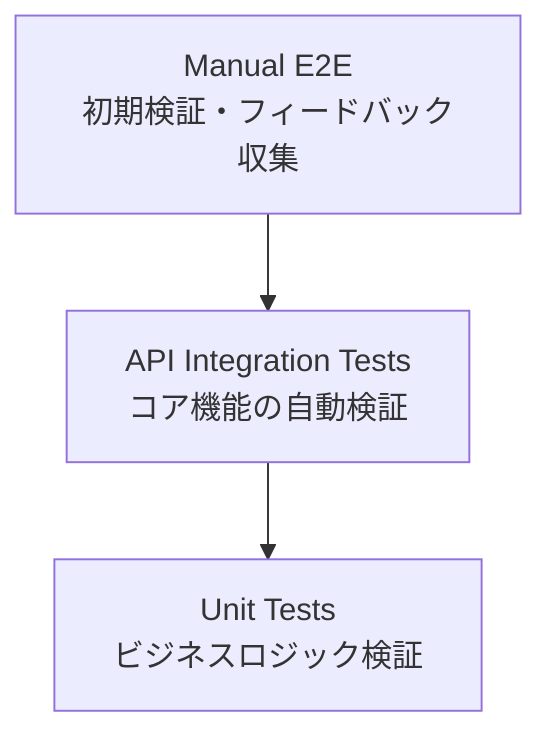

# テスト戦略

## 学習重視のテスト戦略概要

### 実用的テストピラミッド



### フェーズ別テスト方針

#### Phase 1: MVP リリース（最小限のテスト）

1. **Unit Tests (60%)**: ビジネスロジックの基本動作確認
2. **API Integration Tests (30%)**: 重要な API エンドポイント確認
3. **Manual E2E (10%)**: 手動での動作確認・ユーザーフィードバック収集

#### Phase 2: フィードバック反映後（自動化拡充）

- ユーザーフィードバックに基づく自動テスト追加
- 頻繁に発生する問題の自動検証
- CI/CD パイプライン強化

## Phase 1: MVP 向け最小限テスト

### 1. Unit Tests（純粋な単体テスト）

**対象**: 外部依存のないビジネスロジック

```python
# ✅ 優先度: 高 - データモデル検証
def test_question_model_validation():
    question = Question(
        service="EC2",
        question_text="VPCの特徴は？",
        options=["A: 選択肢A", "B: 選択肢B", "C: 選択肢C", "D: 選択肢D"],
        correct_answer="A"
    )
    assert question.is_valid()

# ✅ 優先度: 高 - 類似度判定ロジック
def test_similarity_calculation():
    calculator = SimilarityCalculator()
    similarity = calculator.calculate("VPCとは", "VPCの概要")
    assert 0.0 <= similarity <= 1.0

# ✅ 優先度: 中 - 問題品質チェック
def test_question_quality_check():
    checker = QualityChecker()
    result = checker.validate_question_format(question)
    assert result.is_valid
```

### 2. API Integration Tests（重要エンドポイントのみ）

**対象**: 最も重要な API エンドポイント（moto のみ使用）

```python
# ✅ 優先度: 高 - 問題生成API（motoで完結）
@mock_dynamodb
@pytest.mark.asyncio
async def test_generate_question_api():
    # moto内でDynamoDBテーブル作成（LocalStack不要）
    dynamodb = boto3.resource('dynamodb', region_name='us-east-1')
    table = dynamodb.create_table(
        TableName='questions',
        KeySchema=[{'AttributeName': 'pk', 'KeyType': 'HASH'}],
        AttributeDefinitions=[{'AttributeName': 'pk', 'AttributeType': 'S'}],
        BillingMode='PAY_PER_REQUEST'
    )

    # API呼び出し
    response = await client.post("/api/generate", json={
        "service": "EC2",
        "topic": "VPC"
    })

    assert response.status_code == 202
    assert "job_id" in response.json()

# ✅ 優先度: 中 - 問題取得API（motoで完結）
@mock_dynamodb
async def test_get_question_api():
    # moto内でのテストデータ作成・取得テスト
```

**テスト実装の詳細**: [Python コーディング規約](../../../steering/python-coding-standards.md#テスト) を参照してください。

### 3. Manual E2E（手動検証）

**対象**: ユーザー体験の基本フロー

**手動確認チェックリスト:**

1. **問題生成 → Teams 配信フロー**

   - [ ] API Gateway 経由で問題生成リクエスト送信
   - [ ] Power Automate 経由で Teams チャネルに問題投稿
   - [ ] 問題文・選択肢が正しく表示される

2. **リアクション収集**

   - [ ] A,B,C,D 絵文字リアクションが正常に動作
   - [ ] リアクション数が正しくカウントされる
   - [ ] 複数ユーザーのリアクションが収集される

3. **解答表示**
   - [ ] 一定時間後に解答・解説が自動表示
   - [ ] 正解率・参加者数が正しく表示される
   - [ ] スレッドでの議論が促進される

**確認頻度**: 新機能追加時・重要な変更後

## Phase 2: フィードバック後の自動化拡充

### フィードバック駆動テスト追加

**ユーザーフィードバックに基づく優先順位:**

```python
# 🔄 フィードバック例: "問題が重複している"
def test_duplicate_question_prevention():
    # 重複検出ロジックの自動テスト追加

# 🔄 フィードバック例: "Teams配信が失敗することがある"
@mock_dynamodb
async def test_teams_delivery_reliability():
    # 配信失敗時のリトライ機能テスト追加

# 🔄 フィードバック例: "問題の難易度が不適切"
def test_difficulty_assessment():
    # 難易度判定ロジックのテスト追加
```

### 段階的な統合テスト追加

**Phase 2 で追加予定:**

1. **データベース統合テスト**: 問題が多くなった時点で追加
2. **MCP Server 統合テスト**: 情報取得エラーが頻発した場合に追加
3. **Teams API 統合テスト**: 配信エラーが問題になった場合に追加

### 自動 E2E テスト（Playwright）

**条件**: ユーザーが増えて手動確認が困難になった時点

```typescript
// 🔄 Phase 2で追加予定
test("問題配信から解答表示までの完全フロー", async ({ page, request }) => {
  // API経由で問題生成
  const response = await request.post("/api/generate", {
    data: { service: "EC2", topic: "VPC" },
  });

  // Teams UIでの確認
  await page.goto("https://teams.microsoft.com/...");
  await expect(page.locator('[data-testid="question"]')).toBeVisible();
});
```

## E2E Tests (End-to-End Tests)

### 技術選定の方針

学習用途のため、**Playwright に統一**してシンプルな構成とします：

#### Playwright 統一の理由

- **学習コストの削減**: 1 つのツールに集中して深く学習
- **テストコードの一貫性**: 統一された API とパターン
- **モダンな技術習得**: 業界標準の E2E テストフレームワーク
- **API + UI 統合**: API テストも Playwright で十分対応可能

#### Playwright の技術的利点

- **API テスト機能内蔵**: `request` オブジェクトで HTTP 呼び出し
- **ブラウザ + API 連携**: UI 操作と API 確認の組み合わせが容易
- **TypeScript サポート**: 型安全性による開発効率向上
- **豊富な待機・アサーション**: 非同期処理の確実なテスト

### 1. 問題生成から配信までの基本フロー

- **API 呼び出し**: `request.post()` で API Gateway 呼び出し
- **Teams UI 確認**: ブラウザ自動化で Teams チャネルの問題表示確認
- **データ整合性**: API 経由で DynamoDB データの保存確認
- **非同期処理**: ポーリングによる問題生成完了待機

### 2. 基本的なエラーハンドリング

- **API エラー処理**: 不正な入力データでのエラーレスポンス確認
- **UI エラー表示**: Teams でのエラーメッセージ表示確認

### 3. ユーザー体験フロー

- **問題表示**: Teams チャネルでの問題投稿確認
- **リアクション操作**: A,B,C,D 絵文字リアクションの動作確認
- **解答公開**: 解答・解説の表示確認

### MCP Server 統合による AI 支援テスト

**Playwright MCP Server (`@playwright/mcp@latest`)** の統合により、AI エージェントが直接 E2E テストを実行可能：

#### AI エージェント支援の利点

- **リアルタイム検証**: 開発中の機能を AI が即座にテスト実行
- **テストパターン学習**: AI が過去のテスト結果から最適なテストケースを提案
- **自動デバッグ**: テスト失敗時に AI が原因分析・修正提案を実行
- **継続的品質確保**: コード変更時に AI が関連テストを自動実行

#### 具体的な活用例

```typescript
// AI エージェントが自動実行するテストパターン例
test("AI支援による問題配信フロー検証", async ({ page, request }) => {
  // 1. API経由での問題生成
  const response = await request.post("/api/generate", {
    data: { service: "EC2", topic: "VPC" },
  });

  // 2. Teams UIでの問題表示確認
  await page.goto("https://teams.microsoft.com/...");
  await expect(page.locator('[data-testid="question"]')).toBeVisible();

  // 3. AIが問題内容の妥当性を自動判定
  const questionText = await page
    .locator('[data-testid="question-text"]')
    .textContent();
  // AI エージェントが問題品質を評価・レポート
});
```

## 実用的なテスト戦略の判断基準

### Phase 1（MVP）で実装するテスト

**判断基準**: 開発効率 vs リスク軽減のバランス

```python
# ✅ 実装する - 高頻度で使用される重要ロジック
def test_question_generation_core_logic():
    # 問題生成の基本ロジック

# ✅ 実装する - データ破損リスクが高い
@mock_dynamodb
def test_question_save_and_retrieve():
    # データ永続化の基本動作

# ❌ Phase 1では実装しない - 複雑で頻度が低い
def test_concurrent_question_generation():
    # 同時アクセス時の動作（後回し）
```

### Phase 1 で対象外とする項目

**理由**: 学習効率とリリース速度を優先

- **性能テスト**: ユーザー数が少ない段階では不要
- **障害テスト**: AWS マネージドサービスの信頼性に依存
- **セキュリティテスト**: 社内利用のため最小限
- **複雑な統合テスト**: 手動確認で十分な段階

### フィードバック後の判断基準

**自動テスト追加の優先順位:**

1. **頻繁に発生する問題** → 最優先で自動化
2. **手動確認が困難な問題** → 自動化の効果大
3. **データ整合性に関わる問題** → リスク軽減のため自動化
4. **ユーザー体験に直結する問題** → E2E テスト追加検討

## 学習重視のテスト方針

### 学習目標に基づくテスト範囲

- **基本機能の確実な動作**: Unit Tests + Integration Tests で核となる機能を確認
- **ユーザー体験の検証**: 最小限の E2E テストで重要フローを確認
- **AWS 技術の実践**: LocalStack、moto 等を活用した AWS サービステスト
- **開発効率の向上**: 自動テストによる迅速なフィードバックループ

### 性能テストについて

学習用途のため、以下の理由で性能テストは対象外とします：

- **学習コスト**: 性能テストツールの習得に時間を要する
- **インフラコスト**: 大規模な負荷テストは費用が高額
- **運用複雑性**: 性能監視・分析は高度な専門知識が必要
- **MVP 原則**: 基本機能の確実な実装を優先

必要に応じて、将来的に CloudWatch メトリクスでの基本的な監視から開始可能です。

## テスト自動化と CI/CD 統合

### 1. CI/CD 統合

- **GitHub Actions**: 自動テスト実行ワークフロー
- **テスト段階**: Unit → Integration → E2E の段階的実行
- **LocalStack**: DynamoDB 統合テスト用のローカル AWS 環境
- **カバレッジ**: 80%以上のコードカバレッジ要件

### 2. テスト環境管理

- **テスト分離**: 各テストレベルでの独立した環境
- **モック戦略**: 外部依存関係の適切なモック化
- **データ管理**: テストデータの作成・クリーンアップ
- **シークレット管理**: テスト用 API Key・Webhook URL の安全な管理

### テスト技術別実装詳細

- **Python テスト**: [Python コーディング規約](../../../steering/python-coding-standards.md#テスト) を参照
- **Playwright E2E**: [TypeScript コーディング規約](../../../steering/typescript-coding-standards.md) を参照

### 学習効果

このシンプルなテスト戦略により、以下の技術を実践的に学習できます：

- **Python テスト**: pytest、moto、LocalStack を活用した AWS サービステスト
- **Playwright**: モダンな E2E テストフレームワーク（API + UI 統合）
- **MCP 統合**: Model Context Protocol を通じた AI 支援テスト
- **TypeScript**: 型安全なテストコード作成
- **AI 連携開発**: AI エージェントとの協調によるテスト自動化
- **CI/CD**: GitHub Actions による自動テスト・デプロイパイプライン

### 学習重視の設計判断

- **技術統一**: Playwright に集約することで学習効率を最大化
- **複雑性排除**: 障害テスト・リカバリ機能は学習範囲外
- **実用性重視**: 実際の開発現場で使われる技術に集中
- **段階的学習**: 基本機能から始めて徐々に高度な機能へ

## 学習効果とテスト戦略の進化

### Phase 1 での学習効果

**効率的な学習に集中:**

- **pytest 基礎**: 単体テスト・モック・フィクスチャの実践
- **moto 活用**: AWS サービスのローカルテスト技術
- **API テスト**: FastAPI アプリケーションのテスト手法
- **テスト駆動開発**: 最小限のテストから始める実践的アプローチ

### Phase 2 での学習拡張

**フィードバック駆動の学習:**

- **Playwright**: ユーザーフィードバックに基づく E2E テスト追加
- **統合テスト**: 実際の問題に対応した統合テスト設計
- **CI/CD 最適化**: テスト結果に基づくパイプライン改善
- **監視・ログ**: 本番運用での問題発見・解決手法

### 実用的な学習アプローチ

```python
# Phase 1: 最小限から始める
def test_basic_functionality():
    """基本機能のみテスト - 素早くリリース"""
    pass

# Phase 2: フィードバックに基づいて拡張
def test_user_reported_issue():
    """ユーザーレポートに基づく具体的なテスト追加"""
    pass
```

この段階的アプローチにより、**理論的な完璧さより実用的な価値創出**を重視した学習が可能になります。
