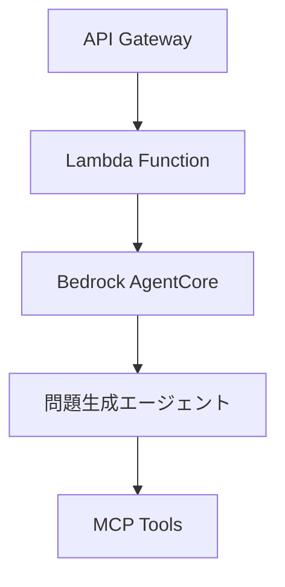

# 設計書作成原則

## 概要

設計書とコーディング規約の適切な役割分担により、保守性と一貫性を確保するための原則を定義します。

## 基本原則

### 1. 役割分担の明確化

#### 設計書の責務

- **アーキテクチャ設計**: システム全体構成、コンポーネント関係
- **データフロー**: 情報の流れ、処理シーケンス
- **技術選択の根拠**: なぜその技術を選んだかの理由
- **概念的な実装方針**: 疑似コードレベルの実装アプローチ

#### コーディング規約の責務

- **具体的な実装詳細**: 実際のコード例、ベストプラクティス
- **コード品質基準**: リンター設定、テスト規約
- **開発環境設定**: IDE 設定、CI/CD 設定
- **命名規則・スタイル**: 変数名、関数名、ファイル構成

### 2. 設計書作成時の注意点

#### ❌ 避けるべき内容

- **具体的な Python コード例**: 実装詳細はコーディング規約に委譲
- **詳細なテストコード**: テスト戦略のみ記載、具体例は規約に委譲
- **開発ツール設定**: GitHub Actions、pytest 設定等は規約に委譲
- **ライブラリ固有の実装**: 特定ライブラリの使用方法詳細

#### ✅ 推奨する内容

- **Mermaid 図**: アーキテクチャ、シーケンス、データフロー図
- **疑似コード**: 言語に依存しない処理フロー
- **概念的な説明**: システムの動作原理、設計思想
- **技術選択の根拠**: なぜその技術・アーキテクチャを選んだか

### 3. 具体的な記述方法

#### コード例の代替手法

**❌ 悪い例（具体的すぎる）:**

```python
from strands import Agent, Tool
from strands.providers.bedrock import BedrockProvider

class AWSDocumentationTool(Tool):
    async def execute(self, service: str, topic: str) -> str:
        return await self.mcp_client.search_docs(service, topic)
```

**✅ 良い例（概念的）:**

```
問題生成エージェント構成:
- エージェントフレームワーク: Strands Agents
- LLMプロバイダー: Amazon Bedrock (Claude)
- 情報取得ツール: MCP統合による AWS公式ドキュメント検索
- 処理フロー: 情報取得 → プロンプト構築 → LLM生成 → 品質検証
```

#### システム構成の表現

**✅ 推奨（Mermaid 図 + 概念説明）:**



**説明:**

- API Gateway: 外部からの問題生成リクエスト受付
- Lambda Function: リクエスト処理と AgentCore 呼び出し
- Bedrock AgentCore: エージェント実行環境
- 問題生成エージェント: Strands Agents ベースの問題生成ロジック
- MCP Tools: AWS 公式ドキュメント取得ツール群

### 4. テスト戦略の記述方法

#### ❌ 避けるべき（具体的テストコード）:

```python
@pytest.mark.asyncio
async def test_generate_question_success(self, service):
    # 具体的なテスト実装
```

#### ✅ 推奨（テスト戦略・方針）:

```
テスト戦略:
- Unit Tests (70%): 個別コンポーネントの動作確認
  - データモデル検証
  - ビジネスロジック単体テスト
  - キャッシュ機能テスト

- Integration Tests (20%): サービス間連携確認
  - DynamoDB統合テスト
  - Teams API統合テスト
  - MCP Server連携テスト

- E2E Tests (10%): エンドツーエンド業務フロー
  - 問題生成から配信までの完全フロー
  - エラーハンドリングフロー
```

### 5. 保守性確保のための原則

#### 情報の一元化

- **技術仕様**: 設計書で一度定義したら、他の箇所では参照のみ
- **実装詳細**: コーディング規約で一元管理、設計書では参照
- **設定情報**: 環境固有の設定は別ファイルで管理

#### 更新時の整合性確保

- **設計変更時**: 影響範囲を明確にし、関連文書の更新を確認
- **技術選択変更時**: 設計書の根拠部分を更新、実装詳細は規約で対応
- **レビュープロセス**: 設計書とコーディング規約の整合性を定期確認

### 6. 文書間の参照方法

#### 設計書からコーディング規約への参照

```markdown
## 実装方針

問題生成サービスの実装詳細については、
[Python コーディング規約](../../../steering/python-coding-standards.md#pydantic-モデル)
を参照してください。

具体的な実装パターン:

- Pydantic モデルによるデータ検証
- 非同期プログラミングパターン
- AWS Lambda PowerTools 活用
```

#### コーディング規約から設計書への参照

```markdown
## プロジェクト固有の実装

本規約は [統合設計書](../specs/aws-exam-agent/design.md) で定義された
アーキテクチャに基づく実装ガイドラインです。

設計書で定義された以下の方針に準拠:

- システムアーキテクチャ
- 技術選択の記録
- 実装方針
```

## チェックリスト

### 設計書作成時

- [ ] 具体的なコード例を避け、概念的な説明に留めているか
- [ ] Mermaid 図でアーキテクチャを視覚化しているか
- [ ] 技術選択の根拠を明記しているか
- [ ] 実装詳細はコーディング規約への参照になっているか

### 設計書レビュー時

- [ ] コーディング規約との重複がないか
- [ ] 実装レベルの詳細が含まれていないか
- [ ] 概念的な説明で理解可能か
- [ ] 将来の技術変更に対応できる抽象度か
- [ ] 外部参照リンクが正確で存在するファイル・セクションを指しているか

### コーディング規約更新時

- [ ] 設計書で定義された方針に準拠しているか
- [ ] 設計書との整合性が保たれているか
- [ ] 実装詳細が適切にカバーされているか

---

**適用範囲**: 全プロジェクトの設計書作成  
**更新日**: 2025 年 8 月 1 日  
**バージョン**: 1.0
