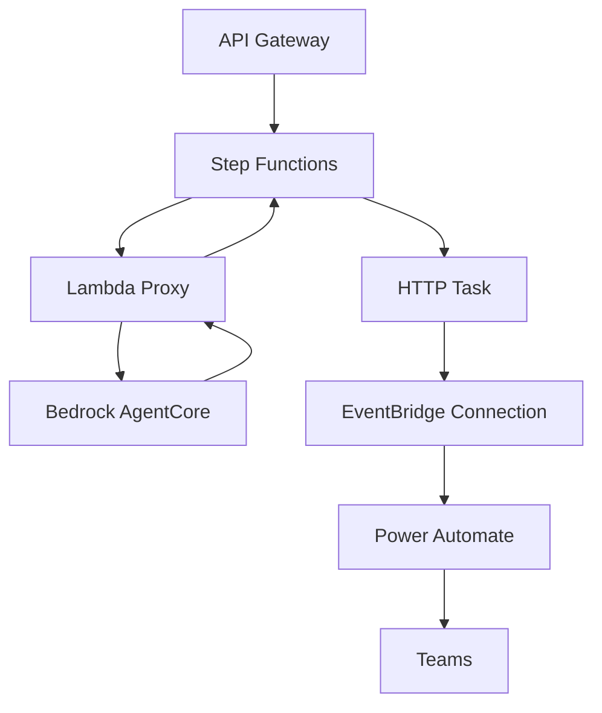

# Step Functions 実装ガイド - AWS Exam Agent

## 概要

このドキュメントは、AWS Exam Agent を Step Functions ワークフローとして実装する場合の包括的なガイドです。
Bedrock AgentCore と Step Functions のネイティブ統合が実現された際の実装方針を記載しています。

## アーキテクチャ概要

### システム構成



### コンポーネント一覧

1. **Step Functions**: メインワークフローオーケストレーション
2. **Lambda Proxy**: Bedrock AgentCore 統合プロキシ
3. **EventBridge Connection**: Power Automate 認証管理
4. **CloudFormation**: インフラストラクチャ管理

## 実装方針

### 技術選択

- **ワークフロー**: AWS Step Functions (JSONata)
- **認証**: EventBridge Connection (API Key)
- **デプロイ**: CloudFormation
- **監視**: CloudWatch + X-Ray

### データフロー

1. **問題生成**: Step Functions → Lambda → Bedrock AgentCore
2. **データ受け渡し**: JSONata 変数による状態間データ共有
3. **Teams 投稿**: HTTP Task → EventBridge Connection → Power Automate

## 次のセクション

詳細な実装内容は以下のセクションで説明します：

- [Step Functions 実装ガイド - AWS Exam Agent](#step-functions-実装ガイド---aws-exam-agent)
  - [概要](#概要)
  - [アーキテクチャ概要](#アーキテクチャ概要)
    - [システム構成](#システム構成)
    - [コンポーネント一覧](#コンポーネント一覧)
  - [実装方針](#実装方針)
    - [技術選択](#技術選択)
    - [データフロー](#データフロー)
  - [次のセクション](#次のセクション)
  - [Step Functions 定義](#step-functions-定義)
    - [ワークフロー定義（JSONata 版）](#ワークフロー定義jsonata-版)
  - [Lambda 実装](#lambda-実装)
    - [Bedrock AgentCore プロキシ関数](#bedrock-agentcore-プロキシ関数)
    - [エラーハンドラー関数](#エラーハンドラー関数)
  - [CloudFormation テンプレート](#cloudformation-テンプレート)
    - [メインテンプレート](#メインテンプレート)
  - [デプロイ手順](#デプロイ手順)
    - [前提条件](#前提条件)
    - [デプロイスクリプト](#デプロイスクリプト)
    - [パラメータファイル例](#パラメータファイル例)
    - [テスト実行](#テスト実行)
  - [監視・運用](#監視運用)
    - [CloudWatch メトリクス](#cloudwatch-メトリクス)
    - [ログ分析クエリ](#ログ分析クエリ)
  - [コスト分析](#コスト分析)
    - [月間コスト見積もり（1,000 回実行）](#月間コスト見積もり1000-回実行)
    - [コスト最適化のポイント](#コスト最適化のポイント)
  - [トラブルシューティング](#トラブルシューティング)
    - [よくある問題と解決方法](#よくある問題と解決方法)
      - [1. Bedrock AgentCore 接続エラー](#1-bedrock-agentcore-接続エラー)
      - [2. Power Automate Webhook 失敗](#2-power-automate-webhook-失敗)
      - [3. Lambda タイムアウト](#3-lambda-タイムアウト)
    - [デバッグ手順](#デバッグ手順)
  - [将来の拡張](#将来の拡張)
    - [Bedrock AgentCore ネイティブ統合対応](#bedrock-agentcore-ネイティブ統合対応)
    - [追加機能の実装](#追加機能の実装)
  - [まとめ](#まとめ)

## Step Functions 定義

### ワークフロー定義（JSONata 版）

```json
{
  "Comment": "AWS Exam Agent - Step Functions Workflow",
  "QueryLanguage": "JSONata",
  "StartAt": "GenerateQuestion",
  "States": {
    "GenerateQuestion": {
      "Type": "Task",
      "Resource": "arn:aws:states:::lambda:invoke",
      "Arguments": {
        "FunctionName": "${BedrockAgentCoreProxyFunction}",
        "Payload": {
          "agentRuntimeArn": "${AgentRuntimeArn}",
          "exam_type": "",
          "category": "",
          "question_count": "",
          "sessionId": ""
        }
      },
      "Assign": {
        "questionData": "",
        "generatedAt": "",
        "sessionId": ""
      },
      "Next": "PostToTeams",
      "Retry": [
        {
          "ErrorEquals": [
            "Lambda.ServiceException",
            "Lambda.AWSLambdaException"
          ],
          "IntervalSeconds": 2,
          "MaxAttempts": 3,
          "BackoffRate": 2.0
        }
      ],
      "Catch": [
        {
          "ErrorEquals": ["States.ALL"],
          "Next": "HandleError",
          "Assign": {
            "errorInfo": ""
          }
        }
      ]
    },
    "PostToTeams": {
      "Type": "Task",
      "Resource": "arn:aws:states:::http:invoke",
      "Arguments": {
        "ApiEndpoint": "${PowerAutomateWebhookUrl}",
        "Method": "POST",
        "Headers": {
          "Content-Type": "application/json"
        },
        "RequestBody": {
          "question_id": "",
          "question_text": "",
          "choices": "",
          "correct_answer": "",
          "explanation": "",
          "service": "",
          "difficulty": "Professional",
          "generated_at": "",
          "session_id": ""
        },
        "Authentication": {
          "ConnectionArn": "${EventBridgeConnectionArn}"
        }
      },
      "Output": {
        "question_generated": true,
        "teams_posted": "",
        "question_id": "",
        "generated_at": ""
      },
      "End": true,
      "Retry": [
        {
          "ErrorEquals": ["States.Http.StatusCodeError"],
          "IntervalSeconds": 2,
          "MaxAttempts": 3,
          "BackoffRate": 2.0
        }
      ],
      "Catch": [
        {
          "ErrorEquals": ["States.ALL"],
          "Next": "HandleError",
          "Assign": {
            "errorInfo": ""
          }
        }
      ]
    },
    "HandleError": {
      "Type": "Task",
      "Resource": "arn:aws:states:::lambda:invoke",
      "Arguments": {
        "FunctionName": "${ErrorHandlerFunction}",
        "Payload": {
          "error": "",
          "execution_arn": "",
          "timestamp": ""
        }
      },
      "End": true
    }
  }
}
```

## Lambda 実装

### Bedrock AgentCore プロキシ関数

```python
# lambda/bedrock_agentcore_proxy.py
import boto3
import json
import logging
from typing import Dict, Any

logger = logging.getLogger()
logger.setLevel(logging.INFO)

def lambda_handler(event: Dict[str, Any], context) -> Dict[str, Any]:
    """
    Bedrock AgentCore プロキシ関数
    Step Functions から Bedrock AgentCore への橋渡し
    """
    try:
        # Bedrock AgentCore クライアント初期化
        client = boto3.client('bedrock-agentcore')

        # リクエストパラメータ取得
        agent_runtime_arn = event['agentRuntimeArn']
        session_id = event['sessionId']

        # プロンプト構築
        prompt = build_prompt(
            exam_type=event['exam_type'],
            category=event.get('category', []),
            question_count=event.get('question_count', 1)
        )

        # AgentCore 呼び出し
        response = client.invoke_agent_runtime(
            agentRuntimeArn=agent_runtime_arn,
            runtimeSessionId=session_id,
            payload=json.dumps({"prompt": prompt}).encode()
        )

        # ストリーミングレスポンス処理
        content = process_streaming_response(response)

        # レスポンス構築
        return {
            'statusCode': 200,
            'body': content,
            'sessionId': session_id
        }

    except Exception as e:
        logger.error(f"Error in bedrock_agentcore_proxy: {str(e)}")
        return {
            'statusCode': 500,
            'body': {'error': str(e)},
            'sessionId': event.get('sessionId', 'unknown')
        }

def build_prompt(exam_type: str, category: list, question_count: int) -> str:
    """問題生成プロンプト構築"""
    exam_names = {
        "SAP": "AWS Certified Solutions Architect - Professional"
    }

    prompt = f"""
    以下の条件に沿って、{question_count}問の実践的な問題を作成してください。

    # 生成条件
    - レベル: {exam_names.get(exam_type, exam_type)}
    - カテゴリ: {category if category else "全般"}
    - 形式: 選択肢問題（A-D）
    - 言語: 日本語

    # 出力形式
    JSON形式で以下の構造で出力してください：
    {{
        "question": "問題文",
        "options": ["A. 選択肢1", "B. 選択肢2", "C. 選択肢3", "D. 選択肢4"],
        "correct_answer": "B",
        "explanation": "解説文",
        "service": "AWSサービス名",
        "source": ["参考URL"]
    }}
    """
    return prompt

def process_streaming_response(response) -> Dict[str, Any]:
    """ストリーミングレスポンス処理"""
    content = []

    if "text/event-stream" in response.get("contentType", ""):
        # ストリーミングレスポンス処理
        for line in response["response"].iter_lines(chunk_size=10):
            if line:
                line = line.decode("utf-8")
                if line.startswith("data: "):
                    content.append(line[6:])
    else:
        # 標準JSONレスポンス処理
        for chunk in response.get("response", []):
            content.append(chunk.decode('utf-8'))

    # JSON パース
    try:
        return json.loads(''.join(content))
    except json.JSONDecodeError:
        return {
            "question": "問題生成に失敗しました",
            "options": ["A. エラー", "B. エラー", "C. エラー", "D. エラー"],
            "correct_answer": "A",
            "explanation": "システムエラーが発生しました",
            "service": "System",
            "source": []
        }
```

### エラーハンドラー関数

```python
# lambda/error_handler.py
import boto3
import json
import logging
from datetime import datetime
from typing import Dict, Any

logger = logging.getLogger()
logger.setLevel(logging.INFO)

def lambda_handler(event: Dict[str, Any], context) -> Dict[str, Any]:
    """
    Step Functions エラーハンドラー
    エラー情報をCloudWatchに記録し、必要に応じて通知
    """
    try:
        error_info = event['error']
        execution_arn = event['execution_arn']
        timestamp = event['timestamp']

        # CloudWatch Logs に詳細エラー記録
        logger.error(f"Step Functions Execution Error: {execution_arn}")
        logger.error(f"Error Details: {json.dumps(error_info, indent=2)}")
        logger.error(f"Timestamp: {timestamp}")

        # CloudWatch メトリクス送信
        cloudwatch = boto3.client('cloudwatch')
        cloudwatch.put_metric_data(
            Namespace='AWS/ExamAgent/StepFunctions',
            MetricData=[
                {
                    'MetricName': 'ExecutionErrors',
                    'Value': 1,
                    'Unit': 'Count',
                    'Dimensions': [
                        {
                            'Name': 'ExecutionArn',
                            'Value': execution_arn
                        }
                    ]
                }
            ]
        )

        # 必要に応じてSNS通知（オプション）
        if should_notify_error(error_info):
            send_error_notification(error_info, execution_arn)

        return {
            'statusCode': 200,
            'body': {
                'error_logged': True,
                'execution_arn': execution_arn,
                'timestamp': timestamp
            }
        }

    except Exception as e:
        logger.error(f"Error in error_handler: {str(e)}")
        return {
            'statusCode': 500,
            'body': {'error': str(e)}
        }

def should_notify_error(error_info: Dict[str, Any]) -> bool:
    """エラー通知が必要かどうかを判定"""
    # 重要なエラーのみ通知
    critical_errors = [
        'States.Runtime',
        'States.ExecutionLimitExceeded',
        'Lambda.ServiceException'
    ]

    error_type = error_info.get('Error', '')
    return any(critical in error_type for critical in critical_errors)

def send_error_notification(error_info: Dict[str, Any], execution_arn: str):
    """SNS経由でエラー通知送信"""
    sns = boto3.client('sns')

    message = f"""
    AWS Exam Agent - Step Functions エラー通知

    実行ARN: {execution_arn}
    エラータイプ: {error_info.get('Error', 'Unknown')}
    エラー詳細: {error_info.get('Cause', 'No details available')}
    発生時刻: {datetime.now().isoformat()}
    """

    # SNS_TOPIC_ARN は環境変数から取得
    topic_arn = os.environ.get('ERROR_NOTIFICATION_TOPIC_ARN')
    if topic_arn:
        sns.publish(
            TopicArn=topic_arn,
            Subject='AWS Exam Agent - Step Functions Error',
            Message=message
        )
```

## CloudFormation テンプレート

### メインテンプレート

```yaml
# cloudformation/step-functions-stack.yaml
AWSTemplateFormatVersion: "2010-09-09"
Description: "AWS Exam Agent - Step Functions Implementation"

Parameters:
  ProjectName:
    Type: String
    Default: "aws-exam-agent"
    Description: "Project name for resource naming"

  Environment:
    Type: String
    Default: "dev"
    AllowedValues: ["dev", "staging", "prod"]
    Description: "Environment name"

  AgentRuntimeArn:
    Type: String
    Description: "Bedrock AgentCore Runtime ARN"

  PowerAutomateWebhookUrl:
    Type: String
    Description: "Power Automate Webhook URL"
    NoEcho: true

  PowerAutomateApiKey:
    Type: String
    Description: "Power Automate API Key"
    NoEcho: true

Resources:
  # EventBridge Connection for Power Automate
  PowerAutomateConnection:
    Type: AWS::Events::Connection
    Properties:
      Name: !Sub "${ProjectName}-${Environment}-power-automate"
      Description: "Power Automate Webhook Connection"
      AuthorizationType: API_KEY
      AuthParameters:
        ApiKeyAuthParameters:
          ApiKeyName: "Authorization"
          ApiKeyValue: !Sub "Bearer ${PowerAutomateApiKey}"

  # IAM Role for Step Functions
  StepFunctionsExecutionRole:
    Type: AWS::IAM::Role
    Properties:
      RoleName: !Sub "${ProjectName}-${Environment}-stepfunctions-role"
      AssumeRolePolicyDocument:
        Version: "2012-10-17"
        Statement:
          - Effect: Allow
            Principal:
              Service: states.amazonaws.com
            Action: sts:AssumeRole
      ManagedPolicyArns:
        - arn:aws:iam::aws:policy/service-role/AWSXRayDaemonWriteAccess
      Policies:
        - PolicyName: StepFunctionsExecutionPolicy
          PolicyDocument:
            Version: "2012-10-17"
            Statement:
              - Effect: Allow
                Action:
                  - lambda:InvokeFunction
                Resource:
                  - !GetAtt BedrockAgentCoreProxyFunction.Arn
                  - !GetAtt ErrorHandlerFunction.Arn
              - Effect: Allow
                Action:
                  - events:RetrieveConnectionCredentials
                Resource: !GetAtt PowerAutomateConnection.Arn
              - Effect: Allow
                Action:
                  - states:InvokeHTTPEndpoint
                Resource: "*"
              - Effect: Allow
                Action:
                  - logs:CreateLogGroup
                  - logs:CreateLogStream
                  - logs:PutLogEvents
                Resource: "*"

  # Lambda Execution Role
  LambdaExecutionRole:
    Type: AWS::IAM::Role
    Properties:
      RoleName: !Sub "${ProjectName}-${Environment}-lambda-role"
      AssumeRolePolicyDocument:
        Version: "2012-10-17"
        Statement:
          - Effect: Allow
            Principal:
              Service: lambda.amazonaws.com
            Action: sts:AssumeRole
      ManagedPolicyArns:
        - arn:aws:iam::aws:policy/service-role/AWSLambdaBasicExecutionRole
        - arn:aws:iam::aws:policy/AWSXRayDaemonWriteAccess
      Policies:
        - PolicyName: BedrockAgentCoreAccess
          PolicyDocument:
            Version: "2012-10-17"
            Statement:
              - Effect: Allow
                Action:
                  - bedrock-agentcore:InvokeAgentRuntime
                Resource: !Ref AgentRuntimeArn
              - Effect: Allow
                Action:
                  - cloudwatch:PutMetricData
                Resource: "*"
              - Effect: Allow
                Action:
                  - sns:Publish
                Resource: !Ref ErrorNotificationTopic

  # Bedrock AgentCore Proxy Function
  BedrockAgentCoreProxyFunction:
    Type: AWS::Lambda::Function
    Properties:
      FunctionName: !Sub "${ProjectName}-${Environment}-bedrock-proxy"
      Runtime: python3.12
      Handler: bedrock_agentcore_proxy.lambda_handler
      Role: !GetAtt LambdaExecutionRole.Arn
      Code:
        ZipFile: |
          # Lambda function code will be deployed separately
          def lambda_handler(event, context):
              return {'statusCode': 200, 'body': 'Placeholder'}
      Timeout: 300
      MemorySize: 512
      Environment:
        Variables:
          AGENT_RUNTIME_ARN: !Ref AgentRuntimeArn
      TracingConfig:
        Mode: Active

  # Error Handler Function
  ErrorHandlerFunction:
    Type: AWS::Lambda::Function
    Properties:
      FunctionName: !Sub "${ProjectName}-${Environment}-error-handler"
      Runtime: python3.12
      Handler: error_handler.lambda_handler
      Role: !GetAtt LambdaExecutionRole.Arn
      Code:
        ZipFile: |
          # Lambda function code will be deployed separately
          def lambda_handler(event, context):
              return {'statusCode': 200, 'body': 'Placeholder'}
      Timeout: 60
      MemorySize: 256
      Environment:
        Variables:
          ERROR_NOTIFICATION_TOPIC_ARN: !Ref ErrorNotificationTopic
      TracingConfig:
        Mode: Active

  # SNS Topic for Error Notifications
  ErrorNotificationTopic:
    Type: AWS::SNS::Topic
    Properties:
      TopicName: !Sub "${ProjectName}-${Environment}-errors"
      DisplayName: "AWS Exam Agent Error Notifications"

  # Step Functions State Machine
  ExamAgentStateMachine:
    Type: AWS::StepFunctions::StateMachine
    Properties:
      StateMachineName: !Sub "${ProjectName}-${Environment}-workflow"
      StateMachineType: STANDARD
      RoleArn: !GetAtt StepFunctionsExecutionRole.Arn
      TracingConfiguration:
        Enabled: true
      LoggingConfiguration:
        Level: ALL
        IncludeExecutionData: true
        Destinations:
          - CloudWatchLogsLogGroup:
              LogGroupArn: !GetAtt StepFunctionsLogGroup.Arn
      DefinitionString: !Sub |
        {
          "Comment": "AWS Exam Agent - Step Functions Workflow",
          "QueryLanguage": "JSONata",
          "StartAt": "GenerateQuestion",
          "States": {
            "GenerateQuestion": {
              "Type": "Task",
              "Resource": "arn:aws:states:::lambda:invoke",
              "Arguments": {
                "FunctionName": "${BedrockAgentCoreProxyFunction}",
                "Payload": {
                  "agentRuntimeArn": "${AgentRuntimeArn}",
                  "exam_type": "",
                  "category": "",
                  "question_count": "",
                  "sessionId": ""
                }
              },
              "Assign": {
                "questionData": "",
                "generatedAt": "",
                "sessionId": ""
              },
              "Next": "PostToTeams",
              "Retry": [
                {
                  "ErrorEquals": ["Lambda.ServiceException", "Lambda.AWSLambdaException"],
                  "IntervalSeconds": 2,
                  "MaxAttempts": 3,
                  "BackoffRate": 2.0
                }
              ],
              "Catch": [
                {
                  "ErrorEquals": ["States.ALL"],
                  "Next": "HandleError",
                  "Assign": {
                    "errorInfo": ""
                  }
                }
              ]
            },
            "PostToTeams": {
              "Type": "Task",
              "Resource": "arn:aws:states:::http:invoke",
              "Arguments": {
                "ApiEndpoint": "${PowerAutomateWebhookUrl}",
                "Method": "POST",
                "Headers": {
                  "Content-Type": "application/json"
                },
                "RequestBody": {
                  "question_id": "",
                  "question_text": "",
                  "choices": "",
                  "correct_answer": "",
                  "explanation": "",
                  "service": "",
                  "difficulty": "Professional",
                  "generated_at": "",
                  "session_id": ""
                },
                "Authentication": {
                  "ConnectionArn": "${PowerAutomateConnection}"
                }
              },
              "Output": {
                "question_generated": true,
                "teams_posted": "",
                "question_id": "",
                "generated_at": ""
              },
              "End": true,
              "Retry": [
                {
                  "ErrorEquals": ["States.Http.StatusCodeError"],
                  "IntervalSeconds": 2,
                  "MaxAttempts": 3,
                  "BackoffRate": 2.0
                }
              ],
              "Catch": [
                {
                  "ErrorEquals": ["States.ALL"],
                  "Next": "HandleError",
                  "Assign": {
                    "errorInfo": ""
                  }
                }
              ]
            },
            "HandleError": {
              "Type": "Task",
              "Resource": "arn:aws:states:::lambda:invoke",
              "Arguments": {
                "FunctionName": "${ErrorHandlerFunction}",
                "Payload": {
                  "error": "",
                  "execution_arn": "",
                  "timestamp": ""
                }
              },
              "End": true
            }
          }
        }

  # CloudWatch Log Group for Step Functions
  StepFunctionsLogGroup:
    Type: AWS::Logs::LogGroup
    Properties:
      LogGroupName: !Sub "/aws/stepfunctions/${ProjectName}-${Environment}"
      RetentionInDays: 30

  # API Gateway for Step Functions (Optional)
  ExamAgentApi:
    Type: AWS::ApiGateway::RestApi
    Properties:
      Name: !Sub "${ProjectName}-${Environment}-api"
      Description: "AWS Exam Agent API"
      EndpointConfiguration:
        Types:
          - REGIONAL

  # API Gateway Resource
  ExamAgentResource:
    Type: AWS::ApiGateway::Resource
    Properties:
      RestApiId: !Ref ExamAgentApi
      ParentId: !GetAtt ExamAgentApi.RootResourceId
      PathPart: "generate"

  # API Gateway Method
  ExamAgentMethod:
    Type: AWS::ApiGateway::Method
    Properties:
      RestApiId: !Ref ExamAgentApi
      ResourceId: !Ref ExamAgentResource
      HttpMethod: POST
      AuthorizationType: NONE
      Integration:
        Type: AWS
        IntegrationHttpMethod: POST
        Uri: !Sub "arn:aws:apigateway:${AWS::Region}:states:action/StartExecution"
        Credentials: !GetAtt ApiGatewayStepFunctionsRole.Arn
        RequestTemplates:
          application/json: !Sub |
            {
              "stateMachineArn": "${ExamAgentStateMachine}",
              "input": "$util.escapeJavaScript($input.body)"
            }
        IntegrationResponses:
          - StatusCode: 200
            ResponseTemplates:
              application/json: |
                {
                  "executionArn": "$input.path('$.executionArn')",
                  "startDate": "$input.path('$.startDate')"
                }
      MethodResponses:
        - StatusCode: 200

  # API Gateway Deployment
  ExamAgentDeployment:
    Type: AWS::ApiGateway::Deployment
    DependsOn: ExamAgentMethod
    Properties:
      RestApiId: !Ref ExamAgentApi
      StageName: !Ref Environment

  # IAM Role for API Gateway to invoke Step Functions
  ApiGatewayStepFunctionsRole:
    Type: AWS::IAM::Role
    Properties:
      AssumeRolePolicyDocument:
        Version: "2012-10-17"
        Statement:
          - Effect: Allow
            Principal:
              Service: apigateway.amazonaws.com
            Action: sts:AssumeRole
      Policies:
        - PolicyName: StepFunctionsExecutionPolicy
          PolicyDocument:
            Version: "2012-10-17"
            Statement:
              - Effect: Allow
                Action:
                  - states:StartExecution
                Resource: !Ref ExamAgentStateMachine

Outputs:
  StateMachineArn:
    Description: "Step Functions State Machine ARN"
    Value: !Ref ExamAgentStateMachine
    Export:
      Name: !Sub "${ProjectName}-${Environment}-state-machine-arn"

  ApiEndpoint:
    Description: "API Gateway Endpoint"
    Value: !Sub "https://${ExamAgentApi}.execute-api.${AWS::Region}.amazonaws.com/${Environment}/generate"
    Export:
      Name: !Sub "${ProjectName}-${Environment}-api-endpoint"

  PowerAutomateConnectionArn:
    Description: "EventBridge Connection ARN"
    Value: !GetAtt PowerAutomateConnection.Arn
    Export:
      Name: !Sub "${ProjectName}-${Environment}-connection-arn"
```

## デプロイ手順

### 前提条件

1. **AWS CLI 設定**: 適切な権限を持つ AWS アカウント
2. **Bedrock AgentCore**: デプロイ済みの AgentCore Runtime
3. **Power Automate**: 設定済みの Webhook URL

### デプロイスクリプト

```bash
#!/bin/bash
# scripts/deploy-step-functions.sh

set -e

# 設定
PROJECT_NAME="aws-exam-agent"
ENVIRONMENT="dev"
REGION="us-east-1"
STACK_NAME="${PROJECT_NAME}-${ENVIRONMENT}-stepfunctions"

# パラメータファイル確認
PARAMS_FILE="cloudformation/parameters-${ENVIRONMENT}.json"
if [ ! -f "$PARAMS_FILE" ]; then
    echo "Error: Parameters file not found: $PARAMS_FILE"
    exit 1
fi

echo "🚀 Deploying Step Functions Stack..."
echo "Stack Name: $STACK_NAME"
echo "Region: $REGION"
echo "Environment: $ENVIRONMENT"

# Lambda関数のパッケージング
echo "📦 Packaging Lambda functions..."
mkdir -p dist/lambda

# Bedrock AgentCore Proxy Function
cp lambda/bedrock_agentcore_proxy.py dist/lambda/
cd dist/lambda
zip -r ../bedrock-proxy.zip bedrock_agentcore_proxy.py
cd ../..

# Error Handler Function
cp lambda/error_handler.py dist/lambda/
cd dist/lambda
zip -r ../error-handler.zip error_handler.py
cd ../..

# CloudFormation デプロイ
echo "☁️ Deploying CloudFormation stack..."
aws cloudformation deploy \
    --template-file cloudformation/step-functions-stack.yaml \
    --stack-name "$STACK_NAME" \
    --parameter-overrides file://"$PARAMS_FILE" \
    --capabilities CAPABILITY_NAMED_IAM \
    --region "$REGION" \
    --no-fail-on-empty-changeset

# Lambda関数コードの更新
echo "🔄 Updating Lambda function code..."
BEDROCK_PROXY_FUNCTION=$(aws cloudformation describe-stacks \
    --stack-name "$STACK_NAME" \
    --region "$REGION" \
    --query "Stacks[0].Outputs[?OutputKey=='BedrockProxyFunctionName'].OutputValue" \
    --output text)

ERROR_HANDLER_FUNCTION=$(aws cloudformation describe-stacks \
    --stack-name "$STACK_NAME" \
    --region "$REGION" \
    --query "Stacks[0].Outputs[?OutputKey=='ErrorHandlerFunctionName'].OutputValue" \
    --output text)

aws lambda update-function-code \
    --function-name "$BEDROCK_PROXY_FUNCTION" \
    --zip-file fileb://dist/bedrock-proxy.zip \
    --region "$REGION"

aws lambda update-function-code \
    --function-name "$ERROR_HANDLER_FUNCTION" \
    --zip-file fileb://dist/error-handler.zip \
    --region "$REGION"

# デプロイ結果の表示
echo "✅ Deployment completed successfully!"
echo ""
echo "📋 Stack Outputs:"
aws cloudformation describe-stacks \
    --stack-name "$STACK_NAME" \
    --region "$REGION" \
    --query "Stacks[0].Outputs[*].[OutputKey,OutputValue]" \
    --output table

# クリーンアップ
rm -rf dist/

echo ""
echo "🎉 Step Functions deployment completed!"
echo "You can now test the workflow using the API endpoint or AWS Console."
```

### パラメータファイル例

```json
// cloudformation/parameters-dev.json
[
  {
    "ParameterKey": "ProjectName",
    "ParameterValue": "aws-exam-agent"
  },
  {
    "ParameterKey": "Environment",
    "ParameterValue": "dev"
  },
  {
    "ParameterKey": "AgentRuntimeArn",
    "ParameterValue": "arn:aws:bedrock-agentcore:us-east-1:123456789012:agent-runtime/your-agent-id"
  },
  {
    "ParameterKey": "PowerAutomateWebhookUrl",
    "ParameterValue": "https://prod-123.westus.logic.azure.com/workflows/abc123/triggers/manual/paths/invoke"
  },
  {
    "ParameterKey": "PowerAutomateApiKey",
    "ParameterValue": "your-power-automate-api-key"
  }
]
```

### テスト実行

```bash
# API Gateway経由でのテスト
curl -X POST \
  https://your-api-id.execute-api.us-east-1.amazonaws.com/dev/generate \
  -H 'Content-Type: application/json' \
  -d '{
    "exam_type": "SAP",
    "category": ["コンピューティング"],
    "question_count": 1
  }'

# AWS CLI経由でのテスト
aws stepfunctions start-execution \
  --state-machine-arn "arn:aws:states:us-east-1:123456789012:stateMachine:aws-exam-agent-dev-workflow" \
  --input '{
    "exam_type": "SAP",
    "category": ["コンピューティング"],
    "question_count": 1
  }'
```

## 監視・運用

### CloudWatch メトリクス

```yaml
# cloudformation/monitoring-stack.yaml (追加テンプレート)
Resources:
  # Step Functions メトリクス用ダッシュボード
  StepFunctionsDashboard:
    Type: AWS::CloudWatch::Dashboard
    Properties:
      DashboardName: !Sub "${ProjectName}-${Environment}-stepfunctions"
      DashboardBody: !Sub |
        {
          "widgets": [
            {
              "type": "metric",
              "properties": {
                "metrics": [
                  ["AWS/States", "ExecutionsSucceeded", "StateMachineArn", "${ExamAgentStateMachine}"],
                  [".", "ExecutionsFailed", ".", "."],
                  [".", "ExecutionsTimedOut", ".", "."]
                ],
                "period": 300,
                "stat": "Sum",
                "region": "${AWS::Region}",
                "title": "Step Functions Executions"
              }
            },
            {
              "type": "metric",
              "properties": {
                "metrics": [
                  ["AWS/States", "ExecutionTime", "StateMachineArn", "${ExamAgentStateMachine}"]
                ],
                "period": 300,
                "stat": "Average",
                "region": "${AWS::Region}",
                "title": "Execution Duration"
              }
            },
            {
              "type": "metric",
              "properties": {
                "metrics": [
                  ["AWS/Lambda", "Duration", "FunctionName", "${BedrockAgentCoreProxyFunction}"],
                  [".", "Errors", ".", "."],
                  [".", "Invocations", ".", "."]
                ],
                "period": 300,
                "stat": "Average",
                "region": "${AWS::Region}",
                "title": "Lambda Performance"
              }
            }
          ]
        }

  # アラーム設定
  ExecutionFailureAlarm:
    Type: AWS::CloudWatch::Alarm
    Properties:
      AlarmName: !Sub "${ProjectName}-${Environment}-execution-failures"
      AlarmDescription: "Step Functions execution failures"
      MetricName: ExecutionsFailed
      Namespace: AWS/States
      Statistic: Sum
      Period: 300
      EvaluationPeriods: 1
      Threshold: 1
      ComparisonOperator: GreaterThanOrEqualToThreshold
      Dimensions:
        - Name: StateMachineArn
          Value: !Ref ExamAgentStateMachine
      AlarmActions:
        - !Ref ErrorNotificationTopic

  LambdaErrorAlarm:
    Type: AWS::CloudWatch::Alarm
    Properties:
      AlarmName: !Sub "${ProjectName}-${Environment}-lambda-errors"
      AlarmDescription: "Lambda function errors"
      MetricName: Errors
      Namespace: AWS/Lambda
      Statistic: Sum
      Period: 300
      EvaluationPeriods: 2
      Threshold: 3
      ComparisonOperator: GreaterThanThreshold
      Dimensions:
        - Name: FunctionName
          Value: !Ref BedrockAgentCoreProxyFunction
      AlarmActions:
        - !Ref ErrorNotificationTopic
```

### ログ分析クエリ

```sql
-- CloudWatch Insights クエリ例

-- Step Functions実行時間分析
fields @timestamp, @message
| filter @message like /ExecutionSucceeded/
| stats avg(@duration) by bin(5m)

-- Lambda関数エラー分析
fields @timestamp, @message, @requestId
| filter @type = "REPORT"
| filter @message like /ERROR/
| sort @timestamp desc
| limit 100

-- Teams投稿成功率
fields @timestamp, @message
| filter @message like /PostToTeams/
| stats count() by @message
```

## コスト分析

### 月間コスト見積もり（1,000 回実行）

| サービス               | 使用量                  | 単価                 | 月額コスト     |
| ---------------------- | ----------------------- | -------------------- | -------------- |
| Step Functions         | 2,000 state transitions | $0.025/1,000         | $0.05          |
| Lambda (Proxy)         | 1,000 回 × 5 秒 × 512MB | $0.0000166667/GB-sec | $0.04          |
| Lambda (Error Handler) | 50 回 × 1 秒 × 256MB    | $0.0000166667/GB-sec | $0.0002        |
| EventBridge Connection | 1 接続                  | $0.41/月             | $0.41          |
| CloudWatch Logs        | 10GB                    | $0.50/GB             | $5.00          |
| API Gateway            | 1,000 リクエスト        | $3.50/百万           | $0.004         |
| **合計**               |                         |                      | **約$5.50/月** |

### コスト最適化のポイント

1. **ログ保持期間**: CloudWatch Logs の保持期間を適切に設定
2. **Lambda メモリ**: 実際の使用量に基づいてメモリサイズを調整
3. **Step Functions**: 不要な state transition を削減
4. **API Gateway**: 必要に応じてキャッシュを有効化

## トラブルシューティング

### よくある問題と解決方法

#### 1. Bedrock AgentCore 接続エラー

```
Error: AccessDeniedException
```

**解決方法**:

- IAM ロールに bedrock-agentcore:InvokeAgentRuntime 権限を追加
- AgentCore Runtime の ARN が正しいことを確認

#### 2. Power Automate Webhook 失敗

```
Error: HTTP 401 Unauthorized
```

**解決方法**:

- EventBridge Connection の API キーを確認
- Power Automate 側の認証設定を確認

#### 3. Lambda タイムアウト

```
Error: Task timed out after 300.00 seconds
```

**解決方法**:

- Lambda 関数のタイムアウト設定を延長
- Bedrock AgentCore のレスポンス時間を確認

### デバッグ手順

1. **Step Functions Console**: 実行履歴とエラー詳細を確認
2. **CloudWatch Logs**: 各 Lambda 関数のログを確認
3. **X-Ray**: 分散トレーシングでボトルネックを特定
4. **CloudWatch Metrics**: パフォーマンスメトリクスを監視

## 将来の拡張

### Bedrock AgentCore ネイティブ統合対応

```json
// 将来のネイティブ統合（予想）
{
  "Type": "Task",
  "Resource": "arn:aws:states:::bedrock-agentcore:invokeAgentRuntime",
  "Parameters": {
    "AgentRuntimeArn": "${AgentRuntimeArn}",
    "RuntimeSessionId.$": "$.sessionId",
    "Payload": {
      "prompt.$": "$.prompt"
    }
  },
  "Next": "PostToTeams"
}
```

### 追加機能の実装

1. **回答収集フロー**: Teams リアクション → 統計分析
2. **スケジュール実行**: EventBridge Rules による定期実行
3. **マルチテナント**: 複数組織対応
4. **A/B テスト**: 複数の問題生成パターンのテスト

---

## まとめ

この Step Functions 実装は、Bedrock AgentCore とのネイティブ統合が実現された際の準備として設計されています。現在は Lambda 経由での統合となりますが、将来的にはより直接的な統合が可能になると予想されます。

CloudFormation テンプレートにより、インフラストラクチャの管理が容易になり、監視・運用面でも充実した機能を提供します。

**実装タイミング**: Bedrock AgentCore の Step Functions ネイティブ統合がリリースされた際に、このガイドを参考に実装を検討してください。
